# Sistema Liberador Inaplast - Guía para Desarrolladores

**Sistema web corporativo** para la gestión y digitalización de procesos de control de calidad en **Inaplast**. Construido con tecnologías modernas: **Nuxt 4**, **Vue 3**, **TailwindCSS** y **Supabase**.

> 📋 **Proyecto Corporativo Privado** - Sistema interno desarrollado específicamente para las operaciones industriales de control de calidad de Inaplast.

## 📚 Índice

- [¿Qué es el Sistema Liberador?](#-qué-es-el-sistema-liberador)
- [Arquitectura del Sistema](#-arquitectura-del-sistema)
- [Stack Tecnológico](#-stack-tecnológico)
- [Estructura del Proyecto](#-estructura-del-proyecto)
- [Configuración Inicial](#-configuración-inicial)
- [Flujo de Desarrollo](#-flujo-de-desarrollo)
- [Funcionalidades Principales](#-funcionalidades-principales)
- [Testing](#-testing)
- [Deployment](#-deployment)
- [Patrones y Convenciones](#-patrones-y-convenciones)
- [Recursos Adicionales](#-recursos-adicionales)

## 🏭 ¿Qué es el Sistema Liberador?

El **Sistema Liberador Inaplast** es una aplicación web que digitaliza y optimiza los procesos de control de calidad industrial, transformando operaciones manuales en flujos de trabajo estructurados y trazables.

### Propósito Principal

- **Digitalizador de procesos**: Reemplaza formularios en papel por interfaces digitales
- **Control de calidad estructurado**: Implementa un flujo de 4 pasos estandarizado con aprobación/rechazo
- **Gestión de personal**: Sistema de roles con permisos granulares (Admin, Supervisor, Inspector)
- **Trazabilidad completa**: Registro detallado de todas las operaciones con timestamps
- **Automatización inteligente**: Extracción de datos usando OCR (Google GenAI + Tesseract.js)
- **Sistema de muestreo**: Planes de muestreo estadístico basados en estándares industriales

### Usuarios del Sistema

- **Inspectores de Calidad**: Ejecutan las liberaciones de productos diariamente
- **Supervisores**: Revisan y aprueban procesos, gestionan equipos
- **Administradores**: Configuran el sistema, gestionan usuarios y datos

## 🏗️ Arquitectura del Sistema

### Diagrama de Alto Nivel

```
┌─────────────────┐    ┌──────────────────┐    ┌─────────────────┐
│   Frontend      │    │   Backend API    │    │   Base de       │
│   (Nuxt 4)      │────│   (Nitro)        │────│   Datos         │
│   Vue 3 + TS    │    │   Server-side    │    │   (Supabase)    │
└─────────────────┘    └──────────────────┘    └─────────────────┘
         │                       │                       │
         │                       │                       │
    ┌────▼────┐            ┌─────▼─────┐           ┌─────▼─────┐
    │ Clientes│            │ Servicios │           │ PostgreSQL│
    │ Móviles │            │ External  │           │ + RLS     │
    │ Tablets │            │ (AI/OCR)  │           │ Políticas │
    └─────────┘            └───────────┘           └───────────┘
```

### Principios Arquitectónicos

1. **API-First**: Toda la lógica de negocio reside en endpoints del servidor Nitro
2. **Type-Safe**: TypeScript estricto con tipos generados automáticamente desde Supabase
3. **Composable Architecture**: Lógica reutilizable mediante composables de Vue 3
4. **Auto-Import System**: Importación automática de componentes, composables y utilidades
5. **Schema-First Validation**: Validación con Zod sincronizada con esquema de base de datos
6. **Database-First Types**: Tipos TypeScript generados directamente desde el esquema PostgreSQL

## 💻 Stack Tecnológico

### Framework y Core

| Tecnología | Versión | Propósito |
|------------|---------|-----------|
| **Nuxt** | 4.0.3 | Meta-framework Vue con SSR/SSG |
| **Vue** | 3.x | Framework reactivo con Composition API |
| **TypeScript** | 5.6.2 | Type safety en todo el stack |
| **TailwindCSS** | 3.4.0 | CSS utility-first para styling |

### Backend y Base de Datos

| Tecnología | Versión | Propósito |
|------------|---------|-----------|
| **Supabase** | 2.53.0 | Backend-as-a-Service con PostgreSQL |
| **Pinia** | 0.11.2 | Gestión de estado reactivo |
| **Zod** | 3.25.76 | Schema validation runtime |

### UI y Experiencia

| Tecnología | Versión | Propósito |
|------------|---------|-----------|
| **Headless UI** | 1.7.23 | Componentes accesibles sin styling |
| **Nuxt Icon** | 1.15.0 | Sistema de iconos optimizado |
| **VeeValidate** | 4.15.1 | Validación de formularios |

### AI y Procesamiento

| Tecnología | Versión | Propósito |
|------------|---------|-----------|
| **Google GenAI** | 1.15.0 | Integración con Gemini AI para OCR |
| **Tesseract.js** | 6.0.1 | OCR local en navegador |
| **Sharp** | 0.34.3 | Compresión de imágenes server-side |

### Testing y Calidad

| Tecnología | Versión | Propósito |
|------------|---------|-----------|
| **Vitest** | 3.2.4 | Unit testing rápido |
| **Playwright** | 1.54.2 | E2E testing cross-browser |
| **Testing Library** | 8.1.0 | Component testing utilities |
| **ESLint** | 9.32.0 | Linting con configuración @antfu |

## 📁 Estructura del Proyecto

### Directorio Principal (`app/`)

```
app/                                    # Código fuente principal
├── components/                         # Componentes Vue (auto-import)
│   ├── ui/                            # Sistema de componentes base
│   │   ├── BaseButton.vue             # Botón con variantes
│   │   ├── BaseModal.vue              # Modal reutilizable
│   │   ├── BaseInput.vue              # Input con validación
│   │   └── ImageUploadOCR.vue         # Subida de imagen con OCR
│   ├── admin/                         # Panel administrativo
│   │   ├── UserTable.vue              # CRUD de usuarios
│   │   └── UserStatsCards.vue         # Métricas del sistema
│   ├── orders/                        # Proceso de liberación
│   │   ├── OrderWizard.vue            # Wizard principal 4 pasos
│   │   ├── OrderWizardStep1.vue       # Subida imagen + cantidad
│   │   ├── OrderWizardStep2.vue       # Datos producto (OCR)
│   │   ├── OrderWizardStep3.vue       # Pruebas de calidad
│   │   └── OrderWizardStep4.vue       # Resumen y decisión
│   └── core/                          # Componentes principales
│       └── AppNavigation.vue          # Navegación responsiva
├── composables/                        # Lógica de negocio (auto-import)
│   ├── auth/                          # Autenticación
│   │   ├── useAuthState.ts            # Estado usuario reactivo
│   │   ├── useAuthLogin.ts            # Login/logout
│   │   └── useAuthToken.ts            # Gestión de tokens
│   ├── admin/                         # Administración
│   │   ├── useAdminUserCRUD.ts        # CRUD operations
│   │   └── useAdminUserManager.ts     # Orquestador principal
│   ├── orders/                        # Liberaciones
│   │   └── useOrderState.ts           # Estado del wizard
│   └── tools/                         # Utilidades
│       ├── useOCRConfig.ts            # Configuración OCR
│       └── useImageCompression.ts     # Compresión imágenes
├── pages/                              # File-based routing
│   ├── auth/                          # Autenticación
│   ├── admin/                         # Panel admin
│   ├── orders/                        # Gestión liberaciones
│   └── muestreo/                      # Control calidad
├── middleware/                         # Protección rutas
│   ├── auth.ts                        # Verificación autenticación
│   └── require-admin-role.ts          # Permisos administrativos
├── schemas/                            # Validación Zod
│   ├── admin/user.ts                  # Schemas usuarios
│   ├── orders/new_order.ts            # Schemas liberaciones
│   └── shared/validation.ts           # Validaciones comunes
├── types/                              # Definiciones TypeScript
│   ├── auth.ts                        # Tipos autenticación
│   ├── orders.ts                      # Tipos liberaciones (mapeo exacto a Supabase)
│   └── database.types.ts              # Tipos generados automáticamente desde Supabase
│
│   # NOTA IMPORTANTE: Los tipos en orders.ts mapean exactamente
│   # las tablas reales de Supabase (orders, tests, orders_tests)
│   # No incluye entidades que no existen (Customer, Product, etc.)
└── utils/                              # Utilidades generales
    ├── formatters.ts                  # Helpers de formateo
    └── supabase.ts                    # Configuración Supabase
```

### Backend API (`server/`)

```
server/                                 # Backend API (Nitro)
├── api/                               # REST endpoints
│   ├── auth/                          # Autenticación
│   │   ├── login.post.ts              # POST /api/auth/login
│   │   ├── user.get.ts                # GET /api/auth/user
│   │   └── logout.post.ts             # POST /api/auth/logout
│   ├── admin/users/                   # Gestión usuarios (admin)
│   │   ├── list.get.ts                # GET lista usuarios paginada
│   │   ├── index.post.ts              # POST crear usuario
│   │   ├── [id].put.ts                # PUT actualizar usuario
│   │   └── [id].delete.ts             # DELETE eliminar usuario
│   ├── orders/                        # Liberaciones de productos
│   │   ├── create.post.ts             # POST crear liberación
│   │   ├── list.get.ts                # GET lista órdenes paginada
│   │   └── [id]/                      # Gestión individual
│   │       └── tests.post.ts          # POST agregar tests a orden
│   ├── ocr/                           # Procesamiento OCR
│   │   └── extract.post.ts            # POST extraer datos imagen (GenAI + Sharp)
│   └── dashboard/                     # Métricas y estadísticas
│       └── metrics.get.ts             # GET métricas sistema
└── utils/auth.ts                      # Utilidades autenticación server-side
```

### Base de Datos (`supabase/`)

```
supabase/                              # Esquema base de datos PostgreSQL
├── config.toml                        # Configuración Supabase
├── migrations/                        # SQL migrations versionadas
│   ├── 20250801000001_initial_schema.sql
│   ├── 20250802000001_add_user_profiles.sql
│   ├── 20250811000001_add_user_activity_logs.sql
│   ├── 20250820000001_add_orders_tests.sql
│   └── 20250825000001_add_sampling_plans.sql
└── seed.sql                           # Datos iniciales desarrollo
```

### Esquema Principal de Tablas

```sql
-- Tabla principal de órdenes (sin campo status)
orders: id, created_at, updated_at, cliente, producto, pedido, 
        fecha_fabricacion, codigo_producto, turno, cantidad_unidades,
        jefe_de_turno, lote, orden_de_compra, numero_operario, 
        maquina, inspector_calidad

-- Tests disponibles (visual/funcional)
tests: id, created_at, name, type

-- Relación orden-test con resultado (aprobado/rechazado)
orders_tests: id, created_at, order, pregunta, aprobado

-- Perfiles de usuario con roles
profiles: id, created_at, updated_at, user_id, first_name, 
         last_name, user_role

-- Sistema de muestreo estadístico
grupos_muestreo: nivel_inspeccion, tamano_lote_desde, 
                tamano_lote_hasta, codigo_plan_muestreo

planes_de_muestreo: codigo, aql, tamano_muestra, 
                   numero_maximo_fallas

-- Enums tipados en PostgreSQL
order_status: "Aprobado" | "Rechazado"
profile_role: "Admin" | "Inspector" | "Supervisor"
test_type: "visual" | "funcional"
```

### Testing (`tests/`)

```
tests/                                 # Suite completa de testing
├── components/                        # Tests componentes Vue
│   └── orders/OrderWizardStep1.test.ts
├── composables/                       # Tests lógica composables
│   ├── auth/useAuthLogin.test.ts          # Tests sistema legado
│   └── auth/useHybridAuth.test.ts         # Tests sistema híbrido
├── middleware/                        # Tests middleware de rutas
│   └── hybrid-auth.test.ts                # Tests autenticación híbrida
├── api/                               # Tests endpoints API
│   ├── auth/login.test.ts                 # Tests endpoint login
│   ├── auth/logout.test.ts                # Tests endpoint logout
│   └── auth/refresh.test.ts               # Tests endpoint refresh
├── e2e/                               # Tests end-to-end
│   ├── auth-flow.spec.ts                  # Flujo completo autenticación
│   └── hybrid-auth-flow.spec.ts           # Flujo híbrido completo
└── setup.ts                           # Configuración testing
```

## 🚀 Configuración Inicial

### Pre-requisitos

- **Node.js** 20+ (LTS recomendado)
- **pnpm** 8+ (package manager del proyecto)
- **Git** 2.40+
- Acceso a credenciales de Supabase y Google AI

### Instalación Paso a Paso

1. **Clonar el repositorio**
   ```bash
   git clone [repositorio_corporativo_privado]
   cd liberador_inaplast_nuxt
   ```

2. **Instalar dependencias**
   ```bash
   pnpm install --frozen-lockfile
   ```

3. **Configurar variables de entorno**
   ```bash
   cp .env.example .env
   ```
   
   Completar el archivo `.env` con:
   ```env
   # Supabase (Backend)
   SUPABASE_URL=https://tu-proyecto.supabase.co
   SUPABASE_ANON_KEY=eyJ0eXAiOiJKV1QiLCJhbGciOiJIUzI1NiJ9...
   SUPABASE_SERVICE_ROLE_KEY=eyJ0eXAiOiJKV1QiLCJhbGciOiJIUzI1NiJ9...
   
   # Google AI (OCR)
   GOOGLE_GENAI_API_KEY=AIzaSy...
   
   # App Config
   NUXT_PUBLIC_APP_NAME="Liberador Inaplast"
   ```

4. **Configurar base de datos**
   ```bash
   # Aplicar migraciones
   npx supabase db push
   
   # Datos de prueba (opcional)
   npx supabase db seed
   ```

5. **Iniciar desarrollo**
   ```bash
   pnpm dev
   ```
   
   La aplicación estará disponible en `http://localhost:3000`

### Verificación de Setup

```bash
# Verificar TypeScript
npx tsc --noEmit

# Verificar linting
pnpm lint

# Ejecutar tests
pnpm test

# Build de producción
pnpm build
```

Si todos los comandos ejecutan sin errores, el setup está completo.

### Crear Usuario Administrador Inicial

Ejecutar en Supabase SQL Editor:

```sql
-- Crear usuario admin inicial
INSERT INTO auth.users (email, encrypted_password, email_confirmed_at)
VALUES ('admin@inaplast.com', crypt('admin123', gen_salt('bf')), NOW());

-- Crear perfil con rol admin
INSERT INTO profiles (user_id, first_name, last_name, user_role)
SELECT id, 'Admin', 'Sistema', 'Admin' 
FROM auth.users WHERE email = 'admin@inaplast.com';
```

## 🔄 Flujo de Desarrollo

### Comandos de Desarrollo

```bash
# Desarrollo con hot-reload
pnpm dev

# Build optimizado
pnpm build

# Preview build local
pnpm preview

# Linting con auto-fix
pnpm lint
pnpm lint:fix

# TypeScript checking
npx tsc --noEmit
```

### Workflow Recomendado

1. **Crear rama de feature**
   ```bash
   git checkout -b feature/nueva-funcionalidad
   ```

2. **Desarrollo con hot-reload**
   ```bash
   pnpm dev
   ```

3. **Quality gates antes de commit**
   ```bash
   npx tsc --noEmit    # ✅ TypeScript
   pnpm lint           # ✅ ESLint
   pnpm test           # ✅ Unit tests
   pnpm build          # ✅ Build
   ```

4. **Commit y push**
   ```bash
   git add .
   git commit -m "feat: descripción del cambio"
   git push origin feature/nueva-funcionalidad
   ```

5. **Crear Pull Request**
   - CI/CD ejecutará tests automáticamente
   - Code review del equipo
   - Merge a `main` = deploy automático

## ⚙️ Funcionalidades Principales

### 1. Proceso de Liberación de Productos

**Flujo de 4 pasos:**
1. **Paso 1**: Subida de imagen de etiqueta + cantidad de unidades
2. **Paso 2**: Detalles del producto (datos extraídos por OCR)
3. **Paso 3**: Pruebas de calidad (tests visuales y funcionales)
4. **Paso 4**: Resumen y decisión final basada en resultados de tests

**Tecnología OCR Avanzada:**
- **Google Gemini AI**: Extracción principal con análisis inteligente
- **Sharp**: Compresión server-side automática para optimizar rendimiento
- **Tesseract.js**: Fallback local para redundancia
- **Validación automática**: Verificación de formato y consistencia de datos

**Sistema de Evaluación:**
- Tests categorizados por tipo (`visual` | `funcional`)
- Resultados binarios por cada test (`aprobado: boolean`)
- Trazabilidad completa de decisiones de calidad

### 2. Panel de Administración

**Funcionalidades:**
- CRUD completo de usuarios
- Gestión de roles y permisos
- Estadísticas y métricas en tiempo real
- Logs de auditoría de actividades

**Arquitectura modular:**
- Componentes especializados (`UserTable`, `UserFilters`, `UserStatsCards`)
- Composables de negocio (`useAdminUserCRUD`, `useAdminUserManager`)
- APIs seguras con validación de permisos

### 3. Sistema de Autenticación Híbrida (JWT + Session)

> **🔒 Solución Híbrida Avanzada** - Sistema de autenticación de doble factor que resolvió los problemas de pérdida de sesión en el perfil de usuario y garantiza seguridad empresarial.

**Problema Resuelto:**
El sistema anterior causaba errores críticos como "No se pudo cargar el perfil del usuario" y pérdida de sesión tras reiniciar el servidor de desarrollo. El sistema híbrido implementado proporciona:

- **Recuperación automática de sesiones** después de reiniciar desarrollo
- **Autenticación consistente** entre cliente y servidor
- **Perfiles de usuario estables** sin errores de carga
- **Seguridad empresarial** con doble verificación

**Arquitectura del Sistema Híbrido:**

```
┌─────────────────┐    ┌──────────────────┐    ┌─────────────────┐
│   Frontend      │    │   Server-side    │    │   Memory Store  │
│   (Cliente)     │    │   (Verificación) │    │   (Sesiones)    │
└─────────────────┘    └──────────────────┘    └─────────────────┘
         │                       │                       │
    JWT (localStorage)       Session ID (cookie)     SessionData
    ┌────▼────┐            ┌─────▼─────┐           ┌─────▼─────┐
    │ Token   │            │ Secure    │           │ {userId,  │
    │ Access  │◄───────────┤ Cookie    │           │ role,     │
    │ Bearer  │            │ httpOnly  │           │ expiresAt}│
    └─────────┘            └───────────┘           └───────────┘
```

**Componentes Principales:**

#### 1. **Utilidades Server-side (`server/utils/hybrid-auth.ts`)**
Núcleo del sistema híbrido con lógica centralizada:

```typescript
// Funciones principales de autenticación
authenticateUser(event, credentials) // Login con JWT + Session
verifyHybridAuth(event) // Verificación dual (JWT + Session)
requireHybridAuth(event) // Middleware de protección
requireHybridAdminAuth(event) // Middleware con permisos de admin

// Gestión de sesiones en memoria (desarrollo)
createSession(userId, role, expirationTime) // Crear sesión
verifySession(sessionId) // Validar sesión activa  
destroySession(sessionId) // Eliminar sesión específica
cleanupExpiredSessions() // Limpieza automática
```

#### 2. **Composable Híbrido (`composables/auth/useHybridAuth.ts`)**
Interface principal del lado cliente:

```typescript
const {
  user,                    // Usuario autenticado reactivo
  isAuthenticated,         // Estado de autenticación
  isAdmin,                // Verificación de rol admin
  login,                  // Login híbrido
  logout,                 // Logout completo (cliente + servidor)
  checkAuth,              // Verificación de autenticación
  getAuthHeaders          // Headers automáticos para requests
} = useHybridAuth()
```

#### 3. **Composable de Perfil (`composables/auth/useAuthProfile.ts`)**
Gestión específica de perfiles integrada con sistema híbrido:

```typescript
const {
  profile,                // Perfil del usuario actual
  profileLoading,         // Estado de carga
  profileError,           // Errores de carga
  fetchUserProfile,       // Obtener perfil con auth híbrida
  hasRole,               // Verificar rol específico
  refreshProfile         // Actualizar perfil
} = useAuthProfile()
```

#### 4. **Endpoint de Perfil (`server/api/auth/profile.get.ts`)**
Endpoint que utiliza autenticación híbrida:

```typescript
// GET /api/auth/profile - Protegido con auth híbrida
export default defineEventHandler(async (event) => {
  // Verificación automática JWT + Session
  const authUser = await verifyHybridAuth(event)
  
  // Obtener perfil desde Supabase con user verificado
  const { data: profile } = await supabase
    .from('profiles')
    .select('*')
    .eq('user_id', authUser.id)
    .single()
  
  return { success: true, profile }
})
```

**Características Técnicas:**

- **Duración de sesión**: 7 días configurables
- **Almacenamiento**: Memory store para desarrollo (migrable a Redis)
- **Cookies**: HttpOnly, Secure, SameSite para máxima seguridad
- **JWT**: Tokens de acceso con expiración sincronizada
- **Limpieza automática**: Sesiones expiradas se eliminan cada hora
- **Roles soportados**: Admin, Supervisor, Inspector

**Flujo de Autenticación Híbrida:**

```mermaid
sequenceDiagram
    participant U as Usuario
    participant C as Cliente (Vue)
    participant S as Servidor (Nitro)
    participant DB as Supabase
    participant M as Memory Store
    
    U->>C: Iniciar sesión
    C->>S: POST /api/auth/login
    S->>DB: Verificar credenciales
    DB-->>S: Usuario válido + perfil
    S->>S: Crear JWT token
    S->>M: Almacenar session ID
    S->>C: Set-Cookie (httpOnly) + JWT (body)
    C->>C: Guardar JWT en localStorage
    
    Note over C,M: Acceso a páginas protegidas
    C->>S: GET /api/auth/profile + Headers
    S->>S: Verificar JWT del header
    S->>S: Verificar Session ID de cookie
    S->>M: Validar sesión activa
    M-->>S: ✅ Sesión válida
    S->>DB: Obtener perfil actualizado
    DB-->>S: Datos de perfil
    S-->>C: ✅ Perfil de usuario
```



**Uso Práctico:**

```vue
<!-- Página de perfil (pages/profile.vue) -->
<script setup>
// Middleware de autenticación híbrida
definePageMeta({
  middleware: ['auth']
})

const { profile, profileLoading } = useAuthProfile()

// El perfil se carga automáticamente con verificación híbrida
</script>

<template>
  <div>
    <div v-if="profileLoading">Cargando perfil...</div>
    <div v-else-if="profile">
      <h1>Bienvenido, {{ profile.first_name }} {{ profile.last_name }}</h1>
      <p>Rol: {{ profile.user_role }}</p>
    </div>
  </div>
</template>
```

```vue
<!-- Página admin (pages/admin/users.vue) -->
<script setup>
// Middleware híbrido con verificación de permisos
definePageMeta({
  middleware: ['auth', 'admin']
})

const { isAdmin } = useHybridAuth()
// isAdmin.value es true automáticamente por el middleware
</script>
```

**Endpoints de Autenticación:**

- `POST /api/auth/login` - Login híbrido (JWT + Session)
- `GET /api/auth/profile` - Obtener perfil con verificación híbrida
- `POST /api/auth/logout` - Logout completo (limpiar servidor + cliente)
- `POST /api/auth/refresh` - Renovar JWT y extender sesión

**Configuración Requerida:**

```env
# Variables esenciales en .env
NUXT_JWT_SECRET=clave_secreta_64_caracteres_minimo_para_firma_jwt
SUPABASE_URL=https://tu-proyecto.supabase.co
SUPABASE_ANON_KEY=tu_anon_key
SUPABASE_SERVICE_ROLE_KEY=tu_service_role_key
```

**Ventajas del Sistema Híbrido:**

✅ **Resolución de errores críticos**: Elimina "No se pudo cargar el perfil del usuario"
✅ **Recuperación automática**: Sesiones persisten tras reiniciar servidor desarrollo
✅ **Seguridad multicapa**: JWT + Session ID requieren compromiso doble
✅ **Performance optimizada**: Verificación local JWT + validación servidor
✅ **Compatibilidad total**: Funciona en SSR, SPA, móviles y tablets
✅ **Auditabilidad completa**: Registro de todas las sesiones activas
✅ **Escalabilidad**: Memory store migrable a Redis sin cambios de código

**Consideraciones de Producción:**

⚠️ **Memory Store → Redis**: Migrar a Redis para alta disponibilidad en producción
⚠️ **Variables de entorno**: Usar secrets management para JWT_SECRET
⚠️ **HTTPS obligatorio**: Cookies seguras requieren certificados SSL
⚠️ **Monitoreo de sesiones**: Supervisar uso de memoria del almacén
⚠️ **Backup de sesiones**: Considerar persistencia para sesiones críticas

### 4. Sistema de Muestreo Estadístico

**Características:**
- **Planes de muestreo**: Basados en estándares industriales MIL-STD
- **Niveles AQL**: Configuración de Acceptable Quality Level
- **Grupos de muestreo**: Rangos automáticos por tamaño de lote
- **Tablas relacionales**: `grupos_muestreo` → `planes_de_muestreo` → `grupos_planes`
- **Cálculo automático**: Tamaño de muestra y número máximo de fallas
- **Integración**: Conectado con el flujo de liberación de productos

## 🔧 Mejoras Técnicas Importantes

### Arreglo Crítico: Configuración de Auto-importación de Componentes UI (v3.1.0+)

**Problema solucionado:** Los botones y componentes UI no se visualizaban correctamente en las páginas de login y administración de usuarios, apareciendo como texto plano en lugar de componentes estilizados.

**Causa raíz identificada:** Inconsistencia en la configuración de auto-importación de componentes UI. El sistema tenía configurado un prefijo "Ui" para los componentes de la carpeta `~/components/ui`, pero algunos archivos los usaban con prefijo (`UiBaseButton`) y otros sin prefijo (`BaseButton`), creando conflictos de resolución.

**Solución técnica implementada:**

1. **Eliminación del prefijo "Ui" en la configuración de Nuxt:**
   ```typescript
   // nuxt.config.ts
   // ❌ Antes: Causaba inconsistencias
   {
     path: '~/components/ui',
     prefix: 'Ui',
     global: true
   }
   
   // ✅ Ahora: Nomenclatura consistente sin prefijo
   {
     path: '~/components/ui',
     global: true
   }
   ```

2. **Actualización consistente en todos los archivos afectados:**
   ```vue
   <!-- ❌ Antes: Uso inconsistente -->
   <UiBaseButton>Botón</UiBaseButton>
   
   <!-- ✅ Ahora: Nomenclatura unificada -->
   <BaseButton>Botón</BaseButton>
   ```

3. **Archivos actualizados para usar nomenclatura sin prefijo:**
   - `app/pages/auth/login.vue` - Componentes de autenticación
   - `app/pages/auth/reset-password.vue` - Recuperación de contraseña  
   - `app/components/core/AppNavigation.vue` - Navegación principal
   - `app/pages/index.vue` - Dashboard principal

**Componentes UI afectados y corregidos:**
- `BaseButton` - Botones con variantes y estados
- `BaseInput` - Campos de entrada con validación
- `BaseCard` - Tarjetas contenedoras
- `BaseModal` - Modales y diálogos
- `BaseAlert` - Alertas y notificaciones
- `BaseDropdown` - Menús desplegables
- `BaseTable` - Tablas de datos
- `BaseBadge` - Etiquetas y badges

**Tests implementados para prevenir regresiones:**
```typescript
// tests/components/ui/component-resolution.test.ts
describe('UI Component Resolution', () => {
  it('should resolve BaseButton component without prefix', () => {
    const wrapper = createWrapper('<BaseButton>Test</BaseButton>')
    expect(wrapper.findComponent({ name: 'BaseButton' }).exists()).toBe(true)
  })
})

// tests/config/components-auto-import.test.ts
describe('Components Auto-import Configuration', () => {
  it('should NOT include Ui prefix for UI components', () => {
    expect(configContent).not.toContain(`prefix: 'Ui'`)
    expect(configContent).toContain(`path: '~/components/ui'`)
  })
})
```

**Impacto positivo de la solución:**
- ✅ **Para usuarios**: Botones y componentes UI se renderizan correctamente
- ✅ **Para desarrolladores**: Nomenclatura consistente y predictible en toda la aplicación
- ✅ **Para el sistema**: Resolución de componentes más eficiente sin conflictos de nombres
- ✅ **Para mantenimiento**: Configuración simplificada que evita futuros errores de inconsistencia

**Evidencia de la corrección:**
- Página de login: Botones "Iniciar Sesión" y "¿Olvidaste tu contraseña?" funcionan correctamente
- Tabla de usuarios admin: Botones "Editar", "Resetear" y "Eliminar" se visualizan como componentes estilizados
- Navegación: Todos los elementos de navegación mantienen su funcionalidad y estilos

Esta mejora garantiza que todos los componentes UI del sistema tengan una nomenclatura consistente y se resuelvan correctamente, eliminando los problemas de visualización que afectaban la experiencia de usuario.

## 🔧 Mejoras Técnicas Importantes

### Arreglo Crítico: Middleware de Autenticación (v3.0.0+)

**Problema solucionado:** Las páginas protegidas como `/orders/new` causaban que los usuarios autenticados perdieran la sesión inmediatamente después del login, especialmente en la funcionalidad de creación de órdenes.

**Causa raíz identificada:** Uso incorrecto de middleware en las definiciones de página. Se usó `middleware: 'auth'` (string) en lugar del formato correcto `middleware: ['auth']` (array), lo que causaba errores de hidratación y pérdida de estado de autenticación.

**Solución técnica implementada:**

1. **Corrección del formato de middleware:**
   ```vue
   <!-- ❌ INCORRECTO - Causa pérdida de sesión -->
   <script setup>
   definePageMeta({
     middleware: 'auth' // String - EVITAR
   })
   </script>
   
   <!-- ✅ CORRECTO - Funciona correctamente -->
   <script setup>
   definePageMeta({
     middleware: ['auth'] // Array - USAR SIEMPRE
   })
   </script>
   ```

2. **Implementación del sistema híbrido mejorado:**
   ```typescript
   // app/middleware/auth.ts - Verificación dual
   export default defineNuxtRouteMiddleware(async (_to) => {
     const { checkAuth, hasValidJWT } = useHybridAuth()
     
     // Verificación rápida con JWT local
     if (!hasValidJWT()) {
       return navigateTo('/auth/login')
     }
     
     // Verificación con servidor (JWT + Session)
     const isAuthenticated = await checkAuth()
     if (!isAuthenticated) {
       return navigateTo('/auth/login')
     }
   })
   ```

3. **Middleware de autorización por roles:**
   ```typescript
   // app/middleware/admin.ts - Permisos granulares
   export default defineNuxtRouteMiddleware(async (_to) => {
     const { checkAuth, isAdmin } = useHybridAuth()
     
     const isAuthenticated = await checkAuth()
     if (!isAuthenticated) {
       return navigateTo('/auth/login')
     }
     
     if (!isAdmin.value) {
       throw createError({
         statusCode: 403,
         statusMessage: 'Se requieren permisos de administrador'
       })
     }
   })
   ```

**Patrones de uso correctos por tipo de página:**

```vue
<!-- Páginas públicas (sin middleware) -->
<script setup>
// login.vue, landing page, etc.
// NO definir middleware
</script>

<!-- Páginas que requieren autenticación básica -->
<script setup>
// orders/new.vue, dashboard, profile, etc.
definePageMeta({
  middleware: ['auth'] // Solo autenticación
})
</script>

<!-- Páginas de administración -->
<script setup>
// admin/users.vue, admin/settings.vue, etc.
definePageMeta({
  middleware: ['auth', 'admin'] // Autenticación + Autorización
})
</script>

<!-- Páginas con roles específicos (futuro) -->
<script setup>
// supervisor/reports.vue, etc.
definePageMeta({
  middleware: ['auth', 'supervisor'] // Ejemplo de extensión
})
</script>
```

**Impacto positivo de la solución:**
- ✅ **Para usuarios**: Sesión estable durante todo el flujo de creación de órdenes
- ✅ **Para desarrolladores**: Sintaxis clara y consistente en toda la aplicación
- ✅ **Para el sistema**: Mejor rendimiento y menos re-autenticaciones innecesarias
- ✅ **Para mantenimiento**: Middlewares reutilizables y fáciles de testear

**Archivos modificados en esta mejora:**
- `app/pages/orders/new.vue` - Corrección del middleware
- `app/middleware/auth.ts` - Middleware híbrido mejorado
- `app/middleware/admin.ts` - Nuevo middleware de autorización
- `app/composables/auth/useHybridAuth.ts` - Sistema híbrido completo
- `server/utils/hybrid-auth.ts` - Utilidades server-side de autenticación
- `app/stores/auth.ts` - Store centralizado de Pinia

**Pruebas implementadas:**
```bash
# Tests de middleware
tests/middleware/hybrid-auth.test.ts
tests/composables/auth/useHybridAuth.test.ts

# Ejecutar tests específicos
pnpm test middleware
pnpm test composables/auth
```

Esta solución garantiza que el sistema de autenticación funcione de manera consistente en toda la aplicación, eliminando los problemas de pérdida de sesión que afectaban la experiencia del usuario.

### Arreglo Crítico Previo: Estado de Autenticación Global (v2.8.5+)

**Problema solucionado:** Los usuarios administradores no veían las opciones de administración en el navbar después de un login exitoso, lo que impedía el acceso al panel administrativo.

**Causa raíz identificada:** El composable `useAuthState` utilizaba estado local (`ref`) en lugar de estado global, causando que cada página mantuviera su propia instancia del estado de autenticación, resultando en inconsistencias entre componentes.

**Solución técnica implementada:**

1. **Refactorización del estado de autenticación:**
   ```typescript
   // ❌ Antes: Estado local por instancia
   const user = ref<AuthUser | null>(null)
   const isAuthenticated = ref(false)
   
   // ✅ Ahora: Estado global compartido
   const user = useState<AuthUser | null>('auth.user', () => null)
   const isAuthenticated = computed(() => !!user.value)
   ```

2. **Actualización inmediata del estado post-login:**
   ```typescript
   // app/pages/auth/login.vue
   const { login } = useAuthLogin()
   const { fetchUser } = useAuthState()
   
   const handleLogin = async () => {
     await login(email, password)
     await fetchUser(true) // ✅ Forzar actualización inmediata
     await router.push('/')
   }
   ```

3. **Limpieza de código de debug:**
   - Removidos console.logs del componente de navegación
   - Actualización de tests para reflejar nuevos headers API

**Impacto positivo:**
- **Para administradores:** Acceso inmediato al menú "Configuración" → "Usuarios" post-login
- **Para desarrolladores:** Estado de autenticación consistente en toda la aplicación
- **Para el sistema:** Mejora en la experiencia de usuario y confiabilidad del estado reactivo

**Archivos modificados:**
- `app/composables/auth/useAuthState.ts` - Migración a `useState`
- `app/pages/auth/login.vue` - Actualización inmediata del estado
- `app/components/core/AppNavigation.vue` - Limpieza de logs
- `tests/composables/auth/useAuthState.test.ts` - Actualización de tests

Esta mejora garantiza que el sistema de roles y permisos funcione correctamente desde el primer momento después del login, mejorando significativamente la experiencia de usuario para los administradores del sistema.

### Guía de Troubleshooting del Sistema de Autenticación

**Problemas Comunes y Soluciones:**

1. **Usuario pierde sesión al navegar entre páginas**
   ```bash
   # Verificar formato de middleware en la página afectada
   # ❌ Incorrecto: middleware: 'auth'
   # ✅ Correcto: middleware: ['auth']
   ```

2. **Error "Token de autenticación requerido"**
   ```typescript
   // Verificar en DevTools
   localStorage.getItem('inaplast_hybrid_jwt') // Debe existir
   document.cookie // Debe contener 'inaplast_session_id'
   ```

3. **Headers de autorización no se envían**
   ```typescript
   const { getAuthHeaders } = useHybridAuth()
   const headers = getAuthHeaders()
   console.log(headers) // Debe mostrar Authorization y X-Auth-Token
   ```

4. **Error 403 en páginas de admin**
   ```typescript
   const { isAdmin, checkAuth } = useHybridAuth()
   await checkAuth()
   console.log('Es admin:', isAdmin.value) // Verificar rol
   ```

5. **Sesión expira inesperadamente**
   ```bash
   # Verificar variables de entorno
   echo $NUXT_JWT_SECRET # Debe estar configurado
   # Verificar logs del servidor para sesiones expiradas
   ```

**Comandos útiles para debugging:**

```bash
# Verificar estado de autenticación en consola del navegador
const { user, isAuthenticated, checkAuth } = useHybridAuth()
await checkAuth()
console.log('Usuario:', user.value)
console.log('Autenticado:', isAuthenticated.value)

# Limpiar estado de autenticación (logout forzoso)
localStorage.removeItem('inaplast_hybrid_jwt')
document.cookie = 'inaplast_session_id=; expires=Thu, 01 Jan 1970 00:00:00 UTC; path=/;'
location.reload()

# Verificar expiración de JWT
const jwt = localStorage.getItem('inaplast_hybrid_jwt')
if (jwt) {
  const parsed = JSON.parse(jwt)
  const expiresAt = new Date(parsed.expires_at * 1000)
  console.log('JWT expira:', expiresAt)
  console.log('Tiempo restante:', expiresAt - new Date())
}
```

**Mejores Prácticas:**

- ✅ Siempre usar `middleware: ['auth']` (array) en lugar de `middleware: 'auth'` (string)
- ✅ Combinar middlewares para permisos granulares: `['auth', 'admin']`
- ✅ Verificar autenticación antes de operaciones críticas
- ✅ Manejar errores de autenticación con redirects apropiados
- ✅ Limpiar estado de autenticación en logout completo
- ❌ Evitar verificaciones de autenticación durante SSR
- ❌ No almacenar datos sensibles en JWT (solo identificadores)
- ❌ No confiar solo en verificación client-side para operaciones críticas

## 🧪 Testing

### Estructura de Testing

El proyecto implementa una estrategia de testing multi-capa:

- **Unit Tests**: Lógica de composables y utilidades
- **Component Tests**: Componentes Vue individuales
- **Integration Tests**: Endpoints de API
- **E2E Tests**: Flujos completos de usuario

### Comandos de Testing

```bash
# Unit testing con Vitest
pnpm test                    # Todos los tests
pnpm test --watch            # Modo watch
pnpm test:coverage           # Reporte de cobertura
pnpm test:ui                 # Runner visual

# Tests específicos del sistema híbrido
pnpm test composables/auth/useHybridAuth  # Tests composable híbrido
pnpm test middleware                      # Tests middleware de rutas
pnpm test api/auth                        # Tests endpoints autenticación

# E2E testing con Playwright
pnpm test:e2e                # Cross-browser E2E
pnpm test:e2e:ui             # Runner visual E2E
pnpm test:e2e --headed       # Con interfaz visual
pnpm test:e2e hybrid-auth-flow # Test flujo híbrido completo
```

### Ejemplo de Test

```typescript
// tests/composables/auth/useHybridAuth.test.ts
import { describe, it, expect, vi } from 'vitest'
import { useHybridAuth } from '~/composables/auth/useHybridAuth'

describe('useHybridAuth', () => {
  it('should perform hybrid login successfully', async () => {
    const { login, isAuthenticated, user } = useHybridAuth()
    
    // Mock de API con respuesta híbrida
    global.$fetch = vi.fn().mockResolvedValue({
      success: true,
      jwt: 'eyJ0eXAiOiJKV1QiLCJhbGciOiJIUzI1NiJ9...',
      user: { 
        id: '123', 
        email: 'admin@inaplast.com', 
        role: 'Admin',
        first_name: 'Admin',
        last_name: 'Sistema'
      }
    })
    
    // Mock localStorage
    Object.defineProperty(window, 'localStorage', {
      value: {
        setItem: vi.fn(),
        getItem: vi.fn().mockReturnValue(null),
        removeItem: vi.fn()
      }
    })
    
    await login('admin@inaplast.com', 'password')
    
    expect(isAuthenticated.value).toBe(true)
    expect(user.value?.role).toBe('Admin')
    expect(localStorage.setItem).toHaveBeenCalled()
  })
  
  it('should verify JWT expiration correctly', () => {
    const { hasValidJWT } = useHybridAuth()
    
    // Mock JWT expirado
    const expiredToken = {
      access_token: 'expired-jwt',
      expires_at: Math.floor(Date.now() / 1000) - 3600, // Hace 1 hora
      user_id: '123'
    }
    
    localStorage.getItem = vi.fn().mockReturnValue(
      JSON.stringify(expiredToken)
    )
    
    expect(hasValidJWT()).toBe(false)
  })
})

// tests/middleware/hybrid-auth.test.ts
import { describe, it, expect, vi } from 'vitest'
import authMiddleware from '~/middleware/auth'

describe('auth middleware', () => {
  it('should redirect to login when no valid JWT', async () => {
    const mockTo = { path: '/orders/new' }
    const mockNavigateTo = vi.fn()
    
    // Mock global functions
    global.navigateTo = mockNavigateTo
    global.import = vi.fn().mockResolvedValue({
      useHybridAuth: () => ({
        hasValidJWT: () => false,
        checkAuth: vi.fn()
      })
    })
    
    await authMiddleware(mockTo)
    
    expect(mockNavigateTo).toHaveBeenCalledWith('/auth/login')
  })
  
  it('should allow access with valid authentication', async () => {
    const mockTo = { path: '/orders/new' }
    const mockNavigateTo = vi.fn()
    
    global.navigateTo = mockNavigateTo
    global.import = vi.fn().mockResolvedValue({
      useHybridAuth: () => ({
        hasValidJWT: () => true,
        checkAuth: vi.fn().mockResolvedValue(true)
      })
    })
    
    const result = await authMiddleware(mockTo)
    
    expect(result).toBeUndefined() // No redirección
    expect(mockNavigateTo).not.toHaveBeenCalled()
  })
})
```

## 🚢 Deployment

### Entorno de Producción

- **Plataforma**: Vercel con optimización Nitro
- **SSR**: Renderizado del lado del servidor
- **CDN**: Edge locations globales
- **SSL**: Certificados automáticos Let's Encrypt

### Variables de Entorno Producción

```env
# Supabase
SUPABASE_URL=https://proyecto-prod.supabase.co
SUPABASE_ANON_KEY=production_anon_key
SUPABASE_SERVICE_ROLE_KEY=production_service_role_key

# Google AI
GOOGLE_GENAI_API_KEY=production_genai_key

# Security
NUXT_SECRET_KEY=generated_64_character_secret_key
```

### CI/CD Pipeline

El proyecto utiliza GitHub Actions para deployment automático:

1. **Quality Gates**: TypeScript, Lint, Tests
2. **Build**: Construcción optimizada para producción
3. **Deploy**: Deployment automático a Vercel
4. **Smoke Tests**: Verificación post-deploy

## 📐 Patrones y Convenciones

### Auto-Import System

```typescript
// ❌ NO necesario - auto-importado
import { useAuthState } from '~/composables/auth/useAuthState'
import BaseButton from '~/components/ui/BaseButton.vue'

// ✅ SÍ - auto-import configurado
const { user, login } = useAuthState()
<BaseButton variant="solid" />
```

### Schema-First Validation

```typescript
// schemas/admin/user.ts
export const createUserSchema = z.object({
  email: z.string().email('Email inválido'),
  first_name: z.string().min(2, 'Mínimo 2 caracteres'),
  last_name: z.string().min(2, 'Mínimo 2 caracteres'),
  user_role: z.enum(['Admin', 'Supervisor', 'Inspector'])
})

export type CreateUserForm = z.infer<typeof createUserSchema>

// schemas/orders/new_order.ts
export const createOrderSchema = z.object({
  cliente: z.string().min(1, 'Cliente requerido'),
  producto: z.string().min(1, 'Producto requerido'),
  cantidad_unidades: z.number().min(1, 'Cantidad debe ser mayor a 0'),
  turno: z.enum(['Mañana', 'Tarde', 'Noche']),
  // Campos mapeados exactamente a estructura Supabase
  codigo_producto: z.string().min(1),
  fecha_fabricacion: z.string(),
  inspector_calidad: z.string(),
  maquina: z.string(),
  numero_operario: z.string(),
  pedido: z.string()
})

// Uso en API
const validatedData = createUserSchema.parse(requestBody)

// Uso en formularios
const { handleSubmit } = useForm({
  validationSchema: toTypedSchema(createUserSchema)
})
```

### Composable Pattern

```typescript
export const useFeatureLogic = () => {
  // Estado reactivo
  const data = ref<DataType[]>([])
  const loading = ref(false)
  
  // Lógica de negocio
  const fetchData = async () => {
    loading.value = true
    try {
      data.value = await $fetch('/api/endpoint')
    } finally {
      loading.value = false
    }
  }
  
  // Estado computado
  const filteredData = computed(() => 
    data.value.filter(item => item.active)
  )
  
  // Exposición controlada
  return {
    data: readonly(data),
    loading: readonly(loading),
    filteredData,
    fetchData
  }
}
```

### Component Architecture

```vue
<!-- Componentes base reutilizables -->
<BaseButton variant="solid" color="indigo" @click="action">
  Texto
</BaseButton>

<!-- Componentes de dominio específicos -->
<UserCreateModal :show="modal" @created="handleCreated" />

<!-- Páginas que orquestan funcionalidades -->
<AdminUsersPage>
  <UserFilters />
  <UserTable />
  <UserPagination />
</AdminUsersPage>
```

## 🔒 Seguridad

### Row Level Security (RLS)

La base de datos implementa políticas de seguridad a nivel de fila con enums tipados:

```sql
-- Usuarios solo ven sus propios datos o si son admin
CREATE POLICY "profiles_select" ON profiles FOR SELECT USING (
  auth.uid() = user_id OR 
  user_has_role('Admin'::profile_role)
);

-- Control de acceso por rol usando enums
CREATE POLICY "orders_select" ON orders FOR SELECT USING (
  CASE 
    WHEN user_has_role('Admin'::profile_role) THEN true
    WHEN user_has_role('Supervisor'::profile_role) THEN true  
    WHEN user_has_role('Inspector'::profile_role) THEN 
      inspector_calidad = (SELECT CONCAT(first_name, ' ', last_name) 
                          FROM profiles WHERE user_id = auth.uid())
    ELSE false
  END
);

-- Funciones de utilidad para verificación de roles
-- is_admin(), is_supervisor_or_admin(), is_inspector_or_above()
-- user_has_role(required_role), can_change_user_role()
```

### Sistema de Autenticación Empresarial

- **Sistema híbrido JWT + Session**: Doble verificación para máxima seguridad
- **Headers de autorización automáticos**: Bearer token + Session ID
- **Middleware granular por roles**: `auth`, `admin`, `supervisor` (extensible)
- **Validación server-side robusta**: Verificación dual en cada endpoint
- **Recuperación automática de sesiones**: Persistencia tras reiniciar servidor desarrollo

## 📚 Recursos Adicionales

### Documentación Técnica

- [Nuxt 4 Documentation](https://nuxt.com)
- [Vue 3 Composition API](https://vuejs.org/guide/extras/composition-api-faq.html)
- [Supabase Documentation](https://supabase.com/docs)
- [TailwindCSS Documentation](https://tailwindcss.com/docs)

### Herramientas de Desarrollo

- **VS Code**: Editor recomendado con extensiones Vue, TypeScript
- **Vue DevTools**: Para debugging de componentes y estado
- **Supabase Studio**: Gestión visual de la base de datos
- **Vercel Dashboard**: Monitoring de deployments

### Convenciones del Proyecto

- **Commits**: Conventional commits (feat, fix, docs, refactor)
- **Branches**: feature/descripcion, hotfix/issue, release/version
- **PRs**: Template con checklist de calidad
- **Issues**: Templates para bugs y features

### Soporte y Contacto

- **Tech Lead**: Arquitectura y decisiones técnicas
- **Senior Developer**: Code reviews y mentoring
- **DevOps**: CI/CD y deployment issues
- **Product Owner**: Requisitos y prioridades de negocio

---

## 📄 Información Legal

**© 2024 Inaplast - Todos los derechos reservados**

Este sistema es propiedad exclusiva de **Inaplast** y contiene información confidencial y procesos industriales propietarios. El uso, modificación o distribución está restringido al personal autorizado de la empresa.

---

**Bienvenido al equipo de desarrollo del Sistema Liberador Inaplast** 🚀

Esta guía te proporcionará todo lo necesario para comenzar a contribuir efectivamente al proyecto. Para dudas específicas, consulta con el equipo técnico o revisa la documentación adicional en la carpeta `/docs` del proyecto.