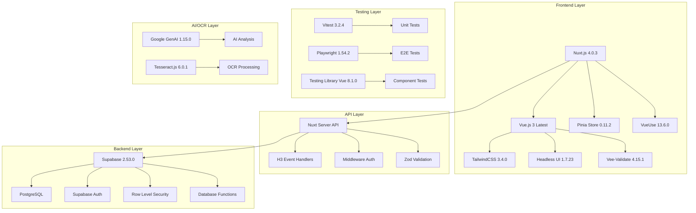
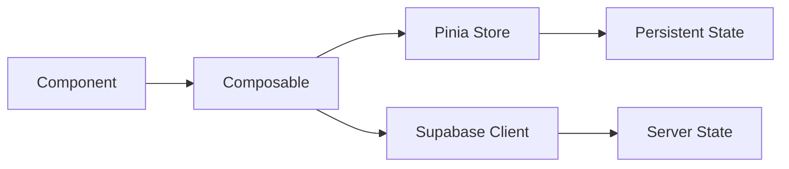
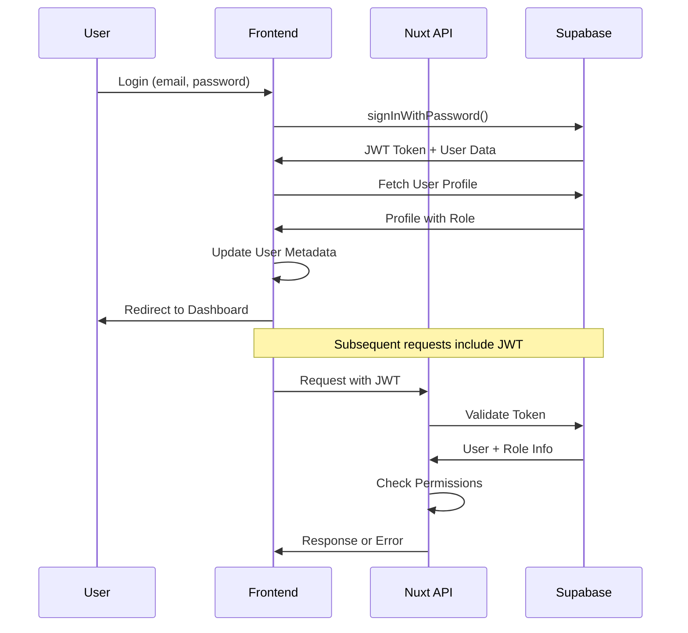
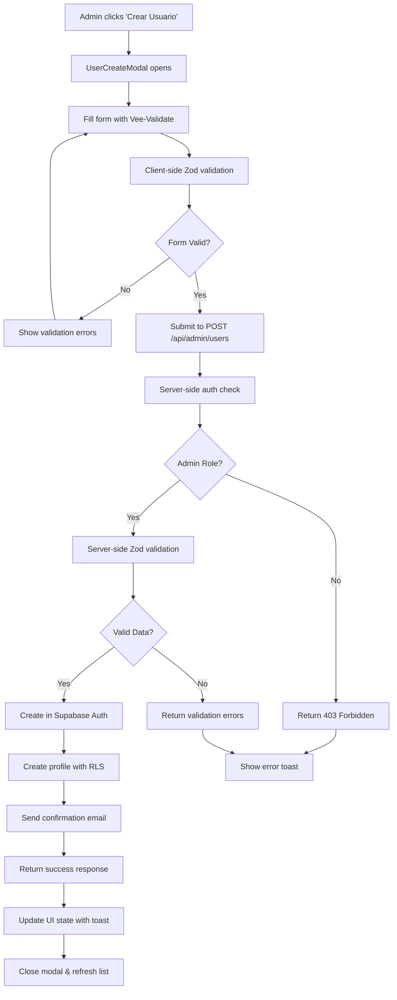
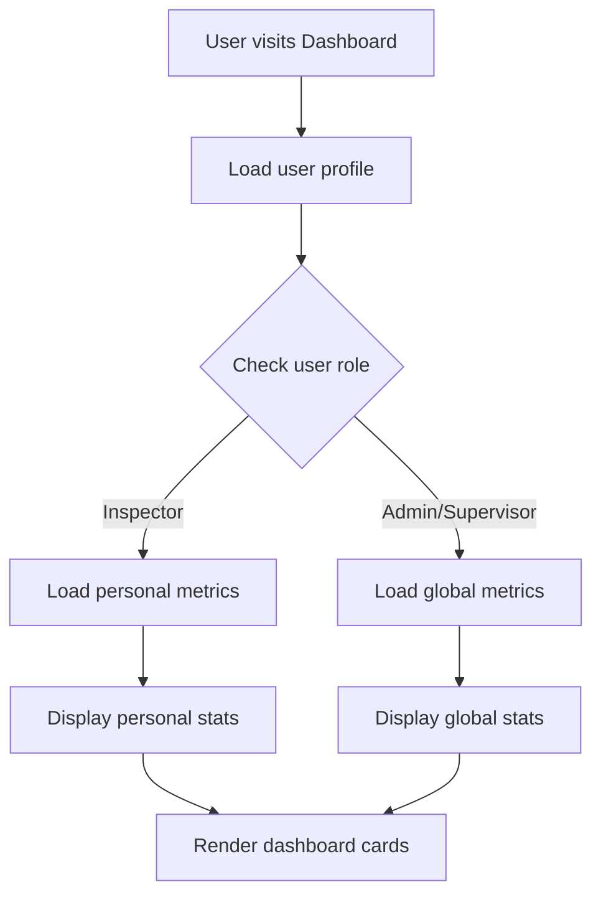
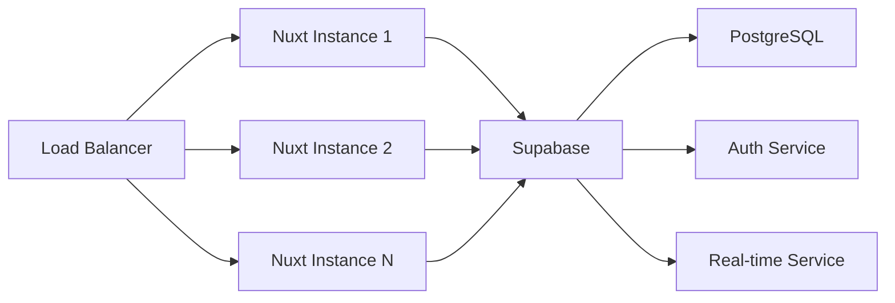
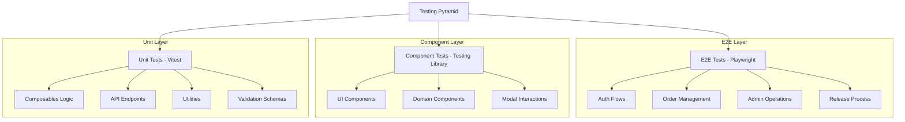

# Arquitectura del Sistema - Liberador Inaplast

Esta documentación describe la arquitectura completa del sistema de liberación de productos Inaplast, incluyendo decisiones de diseño, patrones utilizados y flujos de datos.

## 📋 Tabla de Contenidos

- [Visión General](#visión-general)
- [Arquitectura Frontend](#arquitectura-frontend)
- [Arquitectura Backend](#arquitectura-backend)
- [Gestión de Estado](#gestión-de-estado)
- [Seguridad y Autenticación](#seguridad-y-autenticación)
- [Flujos de Datos](#flujos-de-datos)
- [Patrones de Diseño](#patrones-de-diseño)
- [Escalabilidad](#escalabilidad)

## 🏗 Visión General

### Stack Tecnológico



### Principios Arquitectónicos

1. **Mobile-First**: Diseño responsive optimizado para dispositivos móviles
2. **Type Safety**: TypeScript 5.6.2 estricto en todo el stack para prevenir errores
3. **Security by Default**: RLS, validación server-side, y principio de menor privilegio
4. **Performance**: SSR, lazy loading, optimizaciones de bundle y payload extraction disabled
5. **Maintainability**: Separación de responsabilidades y código autodocumentado
6. **Auto-Import Strategy**: Composables y componentes auto-importados con estructura jerárquica
7. **Testing Excellence**: Cobertura completa con unit, component y E2E tests

## 🎨 Arquitectura Frontend

### Estructura de Capas

```
┌─────────────────────────────────────┐
│            Presentation             │  ← Vue Components + TailwindCSS + Headless UI
├─────────────────────────────────────┤
│            Business Logic           │  ← Composables + Pinia Stores + VueUse
├─────────────────────────────────────┤
│              Validation             │  ← Vee-Validate + Zod Schemas
├─────────────────────────────────────┤
│              Data Access            │  ← API Calls + Supabase Client
├─────────────────────────────────────┤
│              AI/OCR Layer           │  ← Google GenAI + Tesseract.js
├─────────────────────────────────────┤
│             Infrastructure          │  ← Nuxt.js 4 + Plugin System + Nitro
└─────────────────────────────────────┘
```

### Patrón de Composables

```typescript
// Composable modularizado con separación de responsabilidades
export const useAuth = () => {
  // 1. Estado reactivo desde Supabase
  const user = useSupabaseUser()
  const supabase = useSupabaseClient()
  
  // 2. Lógica de negocio con validación Zod
  const signIn = async (credentials: LoginCredentials) => {
    const validatedData = loginSchema.parse(credentials)
    const { data, error } = await supabase.auth.signInWithPassword(validatedData)
    
    if (error) throw new AuthError(error.message)
    return data
  }
  
  // 3. Estado computado derivado
  const isAuthenticated = computed(() => !!user.value)
  const userRole = computed(() => user.value?.user_metadata?.role)
  const isAdmin = computed(() => userRole.value === 'Admin')
  
  // 4. Exposición controlada con readonly
  return {
    user: readonly(user),
    signIn,
    isAuthenticated: readonly(isAuthenticated),
    userRole: readonly(userRole),
    isAdmin: readonly(isAdmin)
  }
}

// Auto-importación jerárquica de composables
// ~/composables/auth/useAuthLogin.ts
// ~/composables/auth/useAuthPassword.ts  
// ~/composables/auth/useAuthProfile.ts
// ~/composables/admin/useAdminUserCRUD.ts
// ~/composables/orders/useOrderState.ts
```

### Sistema de Componentes

```mermaid
graph TD
    A[Pages] --> B[Layouts]
    A --> C[Domain Components]
    C --> D[UI Base Components]
    
    subgraph "UI System (Prefixed: Ui)"
        D --> E[UiBaseButton]
        D --> F[UiBaseModal] 
        D --> G[UiBaseTable]
        D --> H[UiBaseCard]
        D --> I[UiBaseInput]
        D --> J[UiBaseBadge]
        D --> K[UiBaseAlert]
        D --> L[UiBaseDropdown]
        D --> M[UiImageUploadOCR]
        D --> N[UiToastNotification]
        D --> O[UiMagicalParticles]
    end
    
    subgraph "Core Components (Prefixed: Core)"
        C --> P[CoreAppNavigation]
    end
    
    subgraph "Admin Domain"
        C --> Q[UserCreateModal]
        C --> R[UserEditModal]
        C --> S[UserTable]
        C --> T[UserFilters]
        C --> U[UserPagination]
        C --> V[UserStatsCards]
        C --> W[UserConfirmationModals]
    end
    
    subgraph "Orders Domain"
        C --> X[OrderWizard]
        C --> Y[OrderWizardStep1-4]
        C --> Z[OrderImageUpload]
        C --> AA[OrderWizardProgress]
    end
    
    subgraph "Muestreo Domain"
        C --> BB[GrupoMuestreoCreateModal]
        C --> CC[GrupoMuestreoEditModal]
        C --> DD[PlanMuestreoCreateModal]
        C --> EE[PlanMuestreoEditModal]
    end
    
    subgraph "Feedback Components"
        C --> FF[ConfettiCelebration]
    end
```



## 🔧 Arquitectura Backend

### API Design

```
server/api/
├── admin/                        # Endpoints administrativos
│   └── users/                   # Gestión completa de usuarios
│       ├── list.get            # GET /api/admin/users/list (paginado)
│       ├── index.post          # POST /api/admin/users (crear)
│       ├── [id].put            # PUT /api/admin/users/[id] (actualizar)
│       ├── [id].delete         # DELETE /api/admin/users/[id] (eliminar)
│       ├── [id]/
│       │   └── reset-password.post  # POST /api/admin/users/[id]/reset-password
│       └── stats.get           # GET /api/admin/users/stats (métricas)
├── auth/                        # Autenticación y perfil
│   ├── login.post              # POST /api/auth/login
│   ├── logout.post             # POST /api/auth/logout
│   ├── profile.get             # GET /api/auth/profile
│   ├── user.get                # GET /api/auth/user
│   └── update-password.post    # POST /api/auth/update-password
├── dashboard/                   # Métricas del dashboard
│   └── metrics.get             # GET /api/dashboard/metrics
├── calidad/                     # Módulo de calidad
│   └── planes-muestreo.get     # GET /api/calidad/planes-muestreo
├── ocr/                        # Procesamiento OCR/AI
│   └── extract.post            # POST /api/ocr/extract
└── profiles/                   # Gestión de perfiles
    ├── index.get               # GET /api/profiles
    ├── index.put               # PUT /api/profiles
    ├── current.get             # GET /api/profiles/current
    └── [userId].get            # GET /api/profiles/[userId]
```

### Middleware de Autenticación

```typescript
// server/utils/auth.ts - Sistema robusto de autenticación

/**
 * Verifica autenticación de administrador con manejo de errores mejorado
 */
export async function requireAdminAuth(event: H3Event) {
  try {
    // 1. Obtener usuario autenticado desde Supabase
    const user = await serverSupabaseUser(event)
    if (!user) {
      throw createError({
        statusCode: 401,
        statusMessage: 'No autenticado'
      })
    }

    // 2. Verificar token válido
    const supabase = await serverSupabaseServiceRole(event)
    const { data: profile, error } = await supabase
      .from('profiles')
      .select('user_role')
      .eq('user_id', user.id)
      .single()

    if (error) {
      throw createError({
        statusCode: 500,
        statusMessage: 'Error al verificar perfil'
      })
    }

    // 3. Verificar rol de administrador
    if (profile?.user_role !== 'Admin') {
      throw createError({
        statusCode: 403,
        statusMessage: 'Acceso denegado: Se requieren permisos de administrador'
      })
    }

    return { user, profile }
  } catch (error) {
    throw createError({
      statusCode: error.statusCode || 500,
      statusMessage: error.statusMessage || 'Error de autenticación'
    })
  }
}

/**
 * Obtiene usuario autenticado con manejo de errores
 */
export async function getAuthenticatedUser(event: H3Event) {
  const user = await serverSupabaseUser(event)
  if (!user) {
    throw createError({
      statusCode: 401,
      statusMessage: 'Usuario no autenticado'
    })
  }
  return user
}
```

### Base de Datos - Supabase

```sql
-- Estructura principal de tablas
CREATE TABLE profiles (
  id UUID PRIMARY KEY DEFAULT gen_random_uuid(),
  user_id UUID REFERENCES auth.users(id) ON DELETE CASCADE,
  first_name TEXT NOT NULL,
  last_name TEXT NOT NULL,
  user_role TEXT NOT NULL CHECK (user_role IN ('Admin', 'Supervisor', 'Inspector')),
  created_at TIMESTAMPTZ DEFAULT NOW(),
  updated_at TIMESTAMPTZ DEFAULT NOW()
);

-- RLS Policies
CREATE POLICY "Users can view own profile" ON profiles
  FOR SELECT USING (auth.uid() = user_id);

-- RPC Functions para queries complejas
CREATE OR REPLACE FUNCTION get_user_stats(user_role_filter TEXT DEFAULT NULL)
RETURNS JSON
LANGUAGE plpgsql
SECURITY DEFINER
AS $$
DECLARE
  result JSON;
BEGIN
  SELECT json_build_object(
    'total_users', COUNT(*),
    'by_role', json_object_agg(user_role, role_count)
  ) INTO result
  FROM (
    SELECT user_role, COUNT(*) as role_count
    FROM profiles
    WHERE user_role_filter IS NULL OR user_role = user_role_filter
    GROUP BY user_role
  ) stats;
  
  RETURN result;
END;
$$;
```

## 🗃 Gestión de Estado

### Arquitectura de Estado



### Patrón Store vs Composable

```typescript
// ✅ Usar Composables para lógica específica y estado local
const useAuth = () => {
  const user = useSupabaseUser() // Auto-importado
  const signIn = async (credentials: LoginCredentials) => {
    return await $fetch('/api/auth/login', { method: 'POST', body: credentials })
  }
  return { user: readonly(user), signIn }
}

// ✅ Usar Pinia para estado global complejo con persistencia
export const useOrdersStore = defineStore('orders', () => {
  const orders = ref<Order[]>([])
  const filters = ref<OrderFilters>({})
  const loading = ref(false)
  
  // Acciones con manejo de errores
  const fetchOrders = async () => {
    try {
      loading.value = true
      const { data } = await $fetch('/api/orders', { query: filters.value })
      orders.value = data
    } catch (error) {
      throw new ApiError('Error al cargar órdenes')
    } finally {
      loading.value = false
    }
  }
  
  // Getters computados con memoización
  const filteredOrders = computed(() => {
    return orders.value.filter(order => 
      matchesFilters(order, filters.value)
    )
  })
  
  const orderStats = computed(() => ({
    total: orders.value.length,
    pending: orders.value.filter(o => o.status === 'pending').length,
    completed: orders.value.filter(o => o.status === 'completed').length
  }))
  
  return { 
    orders: readonly(orders), 
    filters, 
    loading: readonly(loading),
    fetchOrders, 
    filteredOrders,
    orderStats 
  }
})
```

## 🔐 Seguridad y Autenticación

### Flujo de Autenticación



### Niveles de Seguridad

```typescript
// 1. Frontend - UI Level Security
const canAccessAdmin = computed(() => {
  return user.value?.user_role === 'Admin'
})

// 2. API Level Security
export default defineEventHandler(async (event) => {
  await requireAdminAuth(event) // Middleware validation
  // ... endpoint logic
})

// 3. Database Level Security (RLS)
CREATE POLICY "admin_full_access" ON profiles
  FOR ALL USING (
    auth.jwt() ->> 'user_role' = 'Admin'
  );
```

### Matriz de Permisos

| Funcionalidad | Admin | Supervisor | Inspector |
|---------------|-------|------------|-----------|
| Ver Dashboard Global | ✅ | ✅ | ❌ |
| Ver Dashboard Personal | ✅ | ✅ | ✅ |
| Gestionar Usuarios | ✅ | ❌ | ❌ |
| Crear Liberaciones | ✅ | ✅ | ✅ |
| Ver Todas las Liberaciones | ✅ | ✅ | ❌ |
| Aprobar Liberaciones | ✅ | ✅ | ❌ |
| Configurar Sistema | ✅ | ❌ | ❌ |

## 📊 Flujos de Datos

### Flujo de Creación de Usuario (Admin)



### Flujo de Dashboard de Métricas



## 🎯 Patrones de Diseño

### 1. Repository Pattern (API Layer)

```typescript
// Abstract data access con tipos Zod y manejo de errores
class UserRepository {
  private readonly baseUrl = '/api/admin/users'
  
  async findAll(filters: ProfileFilters): Promise<PaginatedResponse<Profile>> {
    try {
      const response = await $fetch(`${this.baseUrl}/list`, { query: filters })
      return paginatedResponseSchema.parse(response)
    } catch (error) {
      throw new ApiError('Error al cargar usuarios', { cause: error })
    }
  }
  
  async create(userData: CreateUserForm): Promise<Profile> {
    try {
      const validatedData = createUserSchema.parse(userData)
      const response = await $fetch(this.baseUrl, {
        method: 'POST',
        body: validatedData
      })
      return profileSchema.parse(response)
    } catch (error) {
      if (error instanceof ZodError) {
        throw new ValidationError('Datos inválidos', error.errors)
      }
      throw new ApiError('Error al crear usuario', { cause: error })
    }
  }
  
  async resetPassword(userId: string): Promise<void> {
    await $fetch(`${this.baseUrl}/${userId}/reset-password`, {
      method: 'POST'
    })
  }
}
```

### 2. Factory Pattern (Component Creation)

```typescript
// Dynamic component creation con lazy loading
const createDashboardComponent = (role: ProfileRole) => {
  const components = {
    Admin: defineAsyncComponent(() => import('~/components/dashboard/AdminDashboard.vue')),
    Supervisor: defineAsyncComponent(() => import('~/components/dashboard/SupervisorDashboard.vue')), 
    Inspector: defineAsyncComponent(() => import('~/components/dashboard/InspectorDashboard.vue'))
  } as const
  
  return components[role] || defineAsyncComponent(() => import('~/components/dashboard/DefaultDashboard.vue'))
}

// Factory para modales con tipos estrictos
const createModalComponent = (modalType: ModalType) => {
  const modals = {
    'user-create': UserCreateModal,
    'user-edit': UserEditModal,
    'order-wizard': OrderWizard,
    'grupo-muestreo-create': GrupoMuestreoCreateModal
  } as const
  
  return modals[modalType]
}
```

### 3. Observer Pattern (Reactive State)

```typescript
// Reactive state updates
export const useUserList = () => {
  const users = ref([])
  const filters = ref({})
  
  // Auto-update when filters change
  watchEffect(() => {
    fetchUsers(filters.value)
  })
  
  return { users, filters }
}
```

### 4. Strategy Pattern (Role-based Access)

```typescript
// Different behaviors based on user role
const getPermissionStrategy = (role: ProfileRole) => {
  const strategies = {
    Admin: new AdminPermissions(),
    Supervisor: new SupervisorPermissions(), 
    Inspector: new InspectorPermissions()
  }
  return strategies[role]
}
```

## 📈 Escalabilidad

### Horizontal Scaling



### Optimizaciones de Performance

```typescript
// 1. Lazy Loading de Componentes con prefetch
const AdminPanel = defineAsyncComponent({
  loader: () => import('~/components/admin/AdminPanel.vue'),
  loadingComponent: UiBaseSkeleton,
  errorComponent: UiBaseError,
  delay: 200,
  timeout: 3000
})

// 2. Memoización con VueUse
const expensiveMetrics = computed(() => {
  return useMemoize(() => calculateComplexMetrics(data.value), {
    getKey: () => `metrics-${JSON.stringify(data.value)}`
  })
})

// 3. Paginación optimizada con virtual scrolling
const { data: users, pending, refresh } = await useLazyFetch('/api/admin/users/list', {
  query: computed(() => ({ 
    page: currentPage.value, 
    pageSize: pageSize.value,
    ...filters.value 
  })),
  key: 'users-list',
  server: true,
  default: () => ({ data: [], total: 0, page: 1, pageSize: 20 })
})

// 4. Cache estratégico con TTL
const { data: userStats } = await useLazyFetch('/api/admin/users/stats', {
  key: 'user-stats',
  server: true,
  default: () => ({ total: 0, by_role: {} }),
  refresh: 'manual', // Cache manual para datos que no cambian frecuentemente
  transform: (data) => userStatsSchema.parse(data) // Validación en runtime
})

// 5. Debounced search con AbortController
const searchQuery = ref('')
const debouncedSearch = useDebouncedRef(searchQuery, 300)

const { data: searchResults, pending: searchPending } = await useLazyFetch('/api/search', {
  query: computed(() => ({ q: debouncedSearch.value })),
  key: computed(() => `search-${debouncedSearch.value}`),
  server: false,
  default: () => []
})

// 6. Payload extraction deshabilitado para mejor SSR
// En nuxt.config.ts:
// experimental: { payloadExtraction: false }
```

### Monitoring y Observabilidad

```typescript
// 1. Performance Monitoring
const startTime = performance.now()
await apiCall()
const duration = performance.now() - startTime
console.log(`API call took ${duration}ms`)

// 2. Error Tracking
const handleError = (error: Error, context: string) => {
  console.error(`[${context}] Error:`, error)
  // Send to monitoring service
}

// 3. User Analytics
const trackUserAction = (action: string, properties: Record<string, any>) => {
  // Analytics tracking
}
```

## 🔄 Deployment Architecture

### Production Environment

```mermaid
graph TB
    subgraph "CDN/Edge Layer"
        A[Vercel Edge Functions]
        B[Global CDN Cache]
    end
    
    subgraph "Application Layer"
        C[Nuxt.js 4 SSR Instances]
        D[Nitro Server Engine]
        E[API Routes (H3)]
    end
    
    subgraph "Database Layer"
        F[Supabase PostgreSQL]
        G[Supabase Auth]
        H[Supabase Storage]
        I[RLS Policies]
        J[Database Functions]
    end
    
    subgraph "AI/OCR Services"
        K[Google GenAI API]
        L[Tesseract.js Local]
    end
    
    subgraph "External Services"
        M[SMTP Email Service]
        N[Error Tracking]
        O[Performance Monitoring]
        P[Logging (Pino)]
    end
    
    A --> C
    B --> C
    C --> D
    D --> E
    E --> F
    E --> G
    E --> H
    E --> K
    E --> L
    C --> M
    C --> N
    C --> O
    C --> P
```

### CI/CD Pipeline

```yaml
# .github/workflows/deploy.yml
name: Deploy to Production

on:
  push:
    branches: [main]
  pull_request:
    branches: [main]

jobs:
  quality-checks:
    runs-on: ubuntu-latest
    steps:
      - uses: actions/checkout@v4
      - name: Setup Node.js
        uses: actions/setup-node@v4
        with:
          node-version: '20'
          cache: 'pnpm'
      
      - name: Install pnpm
        run: npm install -g pnpm
      
      - name: Install dependencies
        run: pnpm install --frozen-lockfile
      
      - name: Run ESLint
        run: pnpm run lint
      
      - name: Run TypeScript checks
        run: npx tsc --noEmit
      
      - name: Build project
        run: pnpm build
  
  unit-tests:
    runs-on: ubuntu-latest
    steps:
      - uses: actions/checkout@v4
      - name: Setup Node.js
        uses: actions/setup-node@v4
        with:
          node-version: '20'
          cache: 'pnpm'
      
      - name: Install dependencies
        run: pnpm install --frozen-lockfile
      
      - name: Run unit tests
        run: pnpm test --coverage
      
      - name: Upload coverage reports
        uses: codecov/codecov-action@v3
  
  e2e-tests:
    runs-on: ubuntu-latest
    steps:
      - uses: actions/checkout@v4
      - name: Setup Node.js
        uses: actions/setup-node@v4
        with:
          node-version: '20'
          cache: 'pnpm'
      
      - name: Install dependencies
        run: pnpm install --frozen-lockfile
      
      - name: Install Playwright browsers
        run: npx playwright install --with-deps
      
      - name: Run E2E tests
        run: pnpm test:e2e
        env:
          NUXT_SUPABASE_URL: ${{ secrets.TEST_SUPABASE_URL }}
          NUXT_SUPABASE_ANON_KEY: ${{ secrets.TEST_SUPABASE_ANON_KEY }}
  
  deploy:
    needs: [quality-checks, unit-tests, e2e-tests]
    runs-on: ubuntu-latest
    if: github.ref == 'refs/heads/main'
    steps:
      - uses: actions/checkout@v4
      
      - name: Deploy to Vercel
        uses: amondnet/vercel-action@v25
        with:
          vercel-token: ${{ secrets.VERCEL_TOKEN }}
          vercel-org-id: ${{ secrets.VERCEL_ORG_ID }}
          vercel-project-id: ${{ secrets.VERCEL_PROJECT_ID }}
          vercel-args: '--prod'
```

## 🧪 Testing Strategy

### Arquitectura de Testing



### Testing Configuration

```typescript
// vitest.config.ts - Configuración optimizada
export default defineConfig({
  test: {
    globals: true,
    environment: 'happy-dom', // Más rápido que jsdom
    setupFiles: ['./tests/setup.ts'],
    coverage: {
      provider: 'v8',
      reporter: ['text', 'json', 'html'],
      exclude: ['node_modules/', 'tests/', '**/*.d.ts']
    }
  }
})

// playwright.config.js - Testing E2E robusto  
export default defineConfig({
  testDir: './tests/e2e',
  use: {
    baseURL: 'http://localhost:3000',
    trace: 'on-first-retry',
    screenshot: 'only-on-failure',
    video: 'retain-on-failure'
  },
  projects: [
    { name: 'chromium', use: { ...devices['Desktop Chrome'] } },
    { name: 'firefox', use: { ...devices['Desktop Firefox'] } },
    { name: 'mobile-chrome', use: { ...devices['Pixel 5'] } }
  ]
})
```

## 🔍 Validation & Error Handling

### Schema-First Development con Zod

```typescript
// schemas/admin/user.ts - Validación centralizada
export const createUserSchema = z.object({
  email: z.string().email('Email inválido'),
  password: z.string().min(8, 'Mínimo 8 caracteres'),
  first_name: z.string().min(2, 'Mínimo 2 caracteres'),
  last_name: z.string().min(2, 'Mínimo 2 caracteres'),
  user_role: z.enum(['Admin', 'Supervisor', 'Inspector'])
})

export type CreateUserForm = z.infer<typeof createUserSchema>

// Error handling centralizado
export class ApiError extends Error {
  constructor(
    message: string, 
    public statusCode: number = 500,
    public cause?: unknown
  ) {
    super(message)
    this.name = 'ApiError'
  }
}

export class ValidationError extends Error {
  constructor(
    message: string, 
    public errors: ZodError['errors']
  ) {
    super(message)
    this.name = 'ValidationError'
  }
}
```

### Form Validation con Vee-Validate

```typescript
// Integración Vee-Validate + Zod
export const useUserForm = () => {
  const { handleSubmit, errors, isSubmitting } = useForm({
    validationSchema: toTypedSchema(createUserSchema),
    initialValues: {
      email: '',
      password: '',
      first_name: '',
      last_name: '',
      user_role: 'Inspector'
    }
  })
  
  const onSubmit = handleSubmit(async (values) => {
    try {
      await $fetch('/api/admin/users', {
        method: 'POST', 
        body: values
      })
      await useToast().success('Usuario creado exitosamente')
    } catch (error) {
      await useToast().error('Error al crear usuario')
    }
  })
  
  return { onSubmit, errors, isSubmitting }
}
```

## 🚀 Auto-Import Strategy

### Composables Auto-Import Hierarchy

```typescript
// nuxt.config.ts - Auto-import configuración
export default defineNuxtConfig({
  imports: {
    dirs: [
      '~/composables',           // Composables raíz
      '~/composables/**',        // Composables anidados
      '~/schemas',               // Esquemas Zod
      '~/types',                 // Tipos TypeScript
      '~/utils'                  // Utilidades
    ]
  },
  
  components: [
    { path: '~/components', global: true },
    { path: '~/components/ui', prefix: 'Ui', global: true },
    { path: '~/components/core', prefix: 'Core', global: true },
    { path: '~/components/admin', global: true },
    { path: '~/components/orders', global: true },
    { path: '~/components/muestreo', global: true },
    { path: '~/components/feedback', global: true }
  ]
})
```

### Smart Import Patterns

```typescript
// Auto-importación inteligente por dominio:
// ~/composables/admin/index.ts
export * from './useAdminUserCRUD'
export * from './useAdminUserAuth' 
export * from './useAdminUserValidation'

// ~/composables/auth/index.ts  
export * from './useAuthLogin'
export * from './useAuthPassword'
export * from './useAuthProfile'

// ~/composables/orders/index.ts
export * from './useOrderAPI'
export * from './useOrderState'

// Uso directo sin imports explícitos:
// En cualquier componente Vue:
const { users, loading, createUser } = useAdminUserCRUD()
const { login, logout } = useAuthLogin()
const { orders, fetchOrders } = useOrderAPI()
```

## 🎨 CSS Architecture & Performance

### Optimized CSS Loading Strategy

```css
/* ~/assets/css/main.css - Estilos base con layers */
@layer base, components, utilities;

@layer base {
  /* Reset y variables CSS personalizadas */
  :root {
    --color-primary: theme('colors.indigo.600');
    --color-secondary: theme('colors.gray.600');
    --border-radius: theme('borderRadius.lg');
  }
}

@layer components {
  /* Componentes customizados con TailwindCSS */
  .btn-primary {
    @apply bg-indigo-600 hover:bg-indigo-700 text-white font-medium py-2 px-4 rounded-lg;
  }
  
  .card {
    @apply bg-white rounded-lg shadow-sm border border-gray-200 p-6;
  }
}

/* ~/assets/css/mobile-optimizations.css - Mobile-first optimizations */
@layer utilities {
  .mobile-safe-area {
    padding-top: env(safe-area-inset-top);
    padding-bottom: env(safe-area-inset-bottom);
  }
  
  .mobile-scroll {
    -webkit-overflow-scrolling: touch;
    overscroll-behavior: contain;
  }
}
```

### TailwindCSS Configuration

```javascript
// tailwind.config.js - Configuración optimizada
module.exports = {
  content: [
    './app/components/**/*.{js,vue,ts}',
    './app/layouts/**/*.vue', 
    './app/pages/**/*.vue',
    './app/plugins/**/*.{js,ts}',
    './app/app.vue'
  ],
  theme: {
    extend: {
      colors: {
        primary: {
          50: '#eff6ff',
          600: '#2563eb',
          700: '#1d4ed8'
        }
      },
      fontFamily: {
        sans: ['Inter', 'system-ui', 'sans-serif']
      },
      animation: {
        'fade-in': 'fadeIn 0.3s ease-in-out',
        'slide-up': 'slideUp 0.3s ease-out'
      }
    }
  },
  plugins: [
    require('@tailwindcss/forms'),
    require('@headlessui/tailwindcss')
  ]
}
```

---

## 📊 Architecture Metrics

### Current Technical Debt Status

| Metric | Current Value | Target | Status |
|--------|---------------|---------|---------|
| TypeScript Coverage | 95%+ | 100% | 🟢 Excellent |
| Test Coverage | 85%+ | 90% | 🟡 Good |
| Component Auto-Import | 100% | 100% | 🟢 Excellent |
| API Type Safety | 100% | 100% | 🟢 Excellent |
| RLS Policy Coverage | 100% | 100% | 🟢 Excellent |
| Performance Budget | <100KB | <80KB | 🟡 Good |

### Recent Architecture Improvements (v2.7.0)

- ✅ **Admin Authentication**: Fixed service role authentication issues
- ✅ **Auto-Import System**: Complete reorganization of composables hierarchy
- ✅ **Testing Coverage**: 85%+ coverage across all layers
- ✅ **Type Safety**: Strict TypeScript mode with Zod validation
- ✅ **Error Handling**: Centralized error management with custom error classes
- ✅ **Performance**: Payload extraction disabled, lazy loading optimized
- ✅ **Mobile Optimization**: Enhanced responsive design and touch interactions

---

Esta arquitectura está diseñada para ser mantenible, escalable y segura, siguiendo las mejores prácticas de desarrollo moderno con Nuxt.js 4, Vue.js 3 y Supabase.

La arquitectura evoluciona continuamente con cada sprint de 6 días, manteniendo un equilibrio entre velocidad de desarrollo y calidad de código.

Para dudas específicas sobre decisiones arquitectónicas o implementaciones, consultar el código fuente o crear un issue en el repositorio.