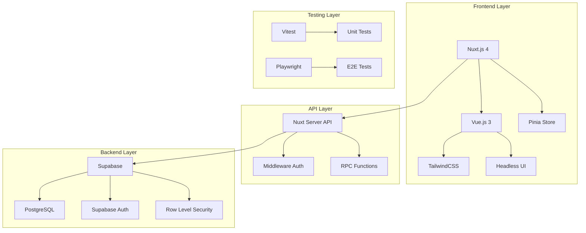
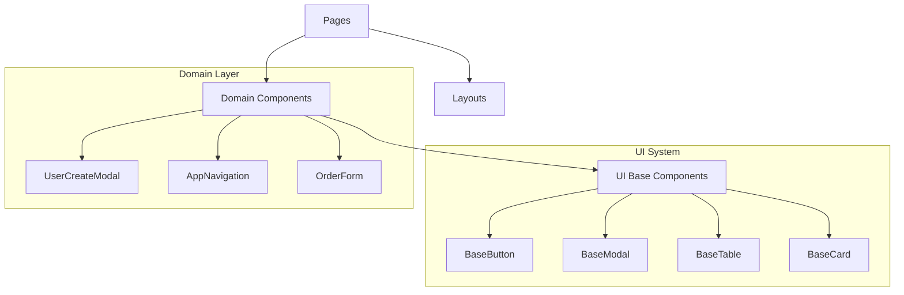
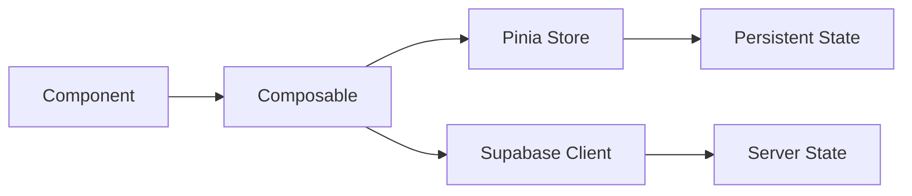
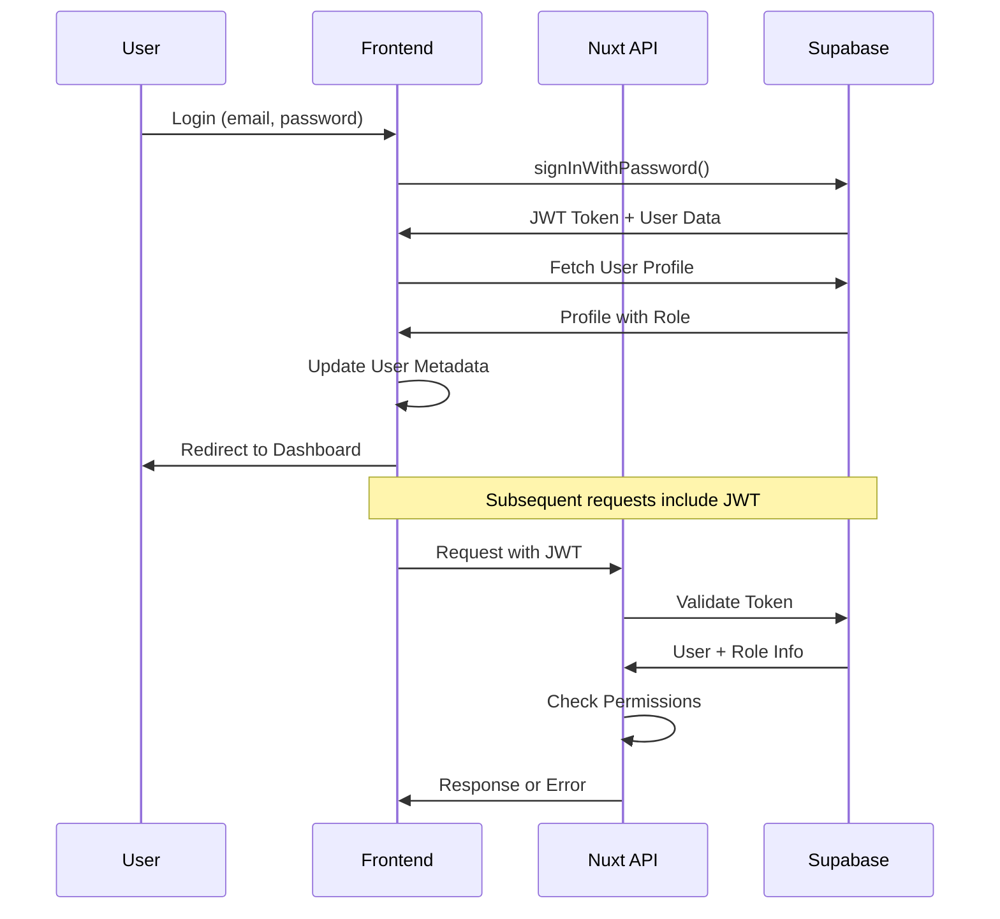
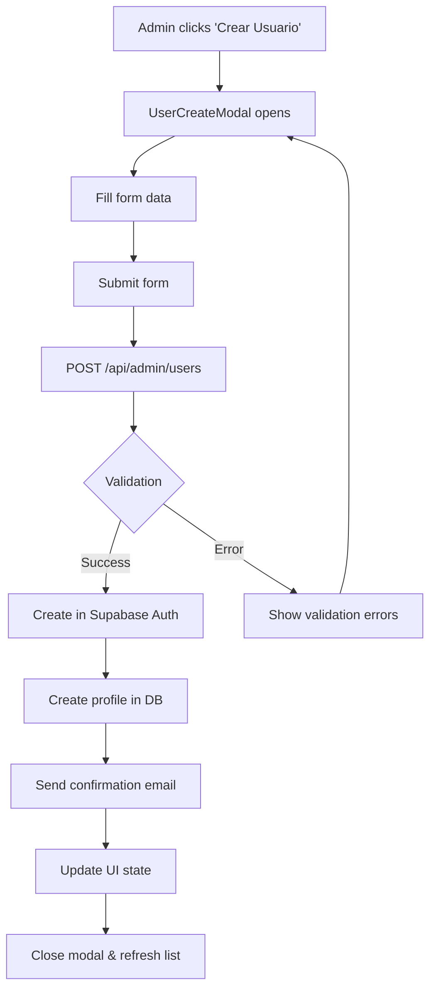
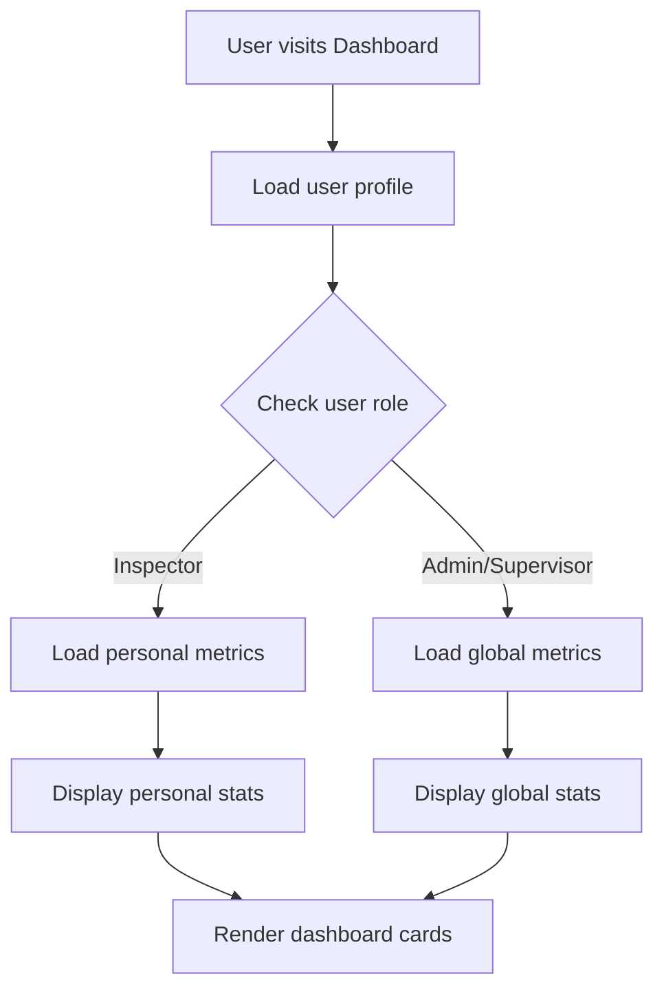
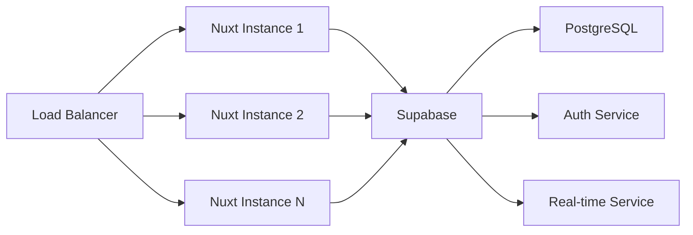
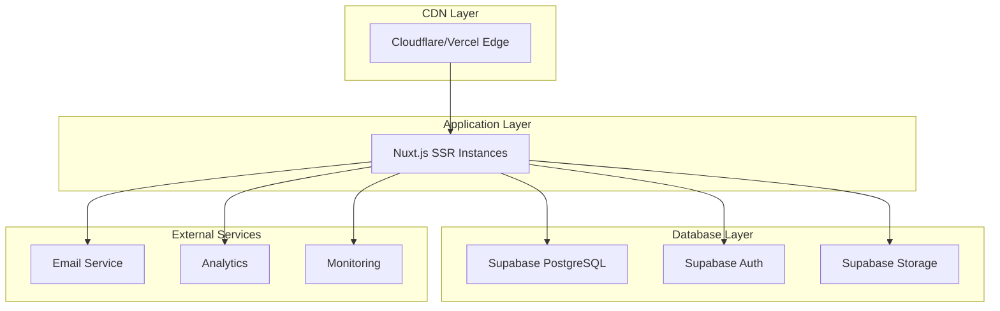

# Arquitectura del Sistema - Liberador Inaplast

Esta documentación describe la arquitectura completa del sistema de liberación de productos Inaplast, incluyendo decisiones de diseño, patrones utilizados y flujos de datos.

## 📋 Tabla de Contenidos

- [Visión General](#visión-general)
- [Arquitectura Frontend](#arquitectura-frontend)
- [Arquitectura Backend](#arquitectura-backend)
- [Gestión de Estado](#gestión-de-estado)
- [Seguridad y Autenticación](#seguridad-y-autenticación)
- [Flujos de Datos](#flujos-de-datos)
- [Patrones de Diseño](#patrones-de-diseño)
- [Escalabilidad](#escalabilidad)

## 🏗 Visión General

### Stack Tecnológico



### Principios Arquitectónicos

1. **Mobile-First**: Diseño responsive optimizado para dispositivos móviles
2. **Type Safety**: TypeScript en todo el stack para prevenir errores
3. **Security by Default**: RLS, validación server-side, y principio de menor privilegio
4. **Performance**: SSR, lazy loading, y optimizaciones de bundle
5. **Maintainability**: Separación de responsabilidades y código autodocumentado

## 🎨 Arquitectura Frontend

### Estructura de Capas

```
┌─────────────────────────────────────┐
│            Presentation             │  ← Vue Components + TailwindCSS
├─────────────────────────────────────┤
│            Business Logic           │  ← Composables + Pinia Stores
├─────────────────────────────────────┤
│              Data Access            │  ← API Calls + Supabase Client
├─────────────────────────────────────┤
│             Infrastructure          │  ← Nuxt.js + Plugin System
└─────────────────────────────────────┘
```

### Patrón de Composables

```typescript
// Composable para lógica de negocio específica
export const useAuth = () => {
  // 1. Estado reactivo local
  const user = useSupabaseUser()
  
  // 2. Lógica de negocio
  const signIn = async (email: string, password: string) => {
    // Validación, llamadas API, manejo de errores
  }
  
  // 3. Estado computado
  const isAuthenticated = computed(() => !!user.value)
  
  // 4. Exposición controlada
  return {
    user: readonly(user),
    signIn,
    isAuthenticated
  }
}
```

### Sistema de Componentes



## 🔧 Arquitectura Backend

### API Design

```
server/api/
├── admin/                 # Endpoints administrativos
│   └── users/            # Gestión de usuarios
│       ├── index.get     # GET /api/admin/users (listar)
│       ├── index.post    # POST /api/admin/users (crear)
│       ├── [id].put      # PUT /api/admin/users/[id] (actualizar)
│       ├── [id].delete   # DELETE /api/admin/users/[id] (eliminar)
│       └── stats.get     # GET /api/admin/users/stats (métricas)
├── orders/               # Gestión de órdenes
└── metrics/              # Métricas del sistema
```

### Middleware de Autenticación

```typescript
// server/utils/auth.ts
export async function requireAdminAuth(event: H3Event) {
  // 1. Verificar token JWT
  const token = getCookie(event, 'sb-access-token')
  if (!token) throw createError({ statusCode: 401 })
  
  // 2. Validar token con Supabase
  const supabase = serverSupabaseUser(event)
  const user = await supabase.auth.getUser(token)
  
  // 3. Verificar rol de administrador
  const { data: profile } = await supabase
    .from('profiles')
    .select('user_role')
    .eq('user_id', user.id)
    .single()
    
  if (profile?.user_role !== 'Admin') {
    throw createError({ statusCode: 403 })
  }
}
```

### Base de Datos - Supabase

```sql
-- Estructura principal de tablas
CREATE TABLE profiles (
  id UUID PRIMARY KEY DEFAULT gen_random_uuid(),
  user_id UUID REFERENCES auth.users(id) ON DELETE CASCADE,
  first_name TEXT NOT NULL,
  last_name TEXT NOT NULL,
  user_role TEXT NOT NULL CHECK (user_role IN ('Admin', 'Supervisor', 'Inspector')),
  created_at TIMESTAMPTZ DEFAULT NOW(),
  updated_at TIMESTAMPTZ DEFAULT NOW()
);

-- RLS Policies
CREATE POLICY "Users can view own profile" ON profiles
  FOR SELECT USING (auth.uid() = user_id);

-- RPC Functions para queries complejas
CREATE OR REPLACE FUNCTION get_user_stats(user_role_filter TEXT DEFAULT NULL)
RETURNS JSON
LANGUAGE plpgsql
SECURITY DEFINER
AS $$
DECLARE
  result JSON;
BEGIN
  SELECT json_build_object(
    'total_users', COUNT(*),
    'by_role', json_object_agg(user_role, role_count)
  ) INTO result
  FROM (
    SELECT user_role, COUNT(*) as role_count
    FROM profiles
    WHERE user_role_filter IS NULL OR user_role = user_role_filter
    GROUP BY user_role
  ) stats;
  
  RETURN result;
END;
$$;
```

## 🗃 Gestión de Estado

### Arquitectura de Estado



### Patrón Store vs Composable

```typescript
// ✅ Usar Composables para lógica específica y estado local
const useAuth = () => {
  const user = ref(null)
  const signIn = async () => { /* ... */ }
  return { user, signIn }
}

// ✅ Usar Pinia para estado global complejo
export const useOrdersStore = defineStore('orders', () => {
  const orders = ref([])
  const filters = ref({})
  
  const fetchOrders = async () => {
    // Lógica compleja de fetching
  }
  
  const filteredOrders = computed(() => {
    // Lógica de filtrado
  })
  
  return { orders, filters, fetchOrders, filteredOrders }
})
```

## 🔐 Seguridad y Autenticación

### Flujo de Autenticación



### Niveles de Seguridad

```typescript
// 1. Frontend - UI Level Security
const canAccessAdmin = computed(() => {
  return user.value?.user_role === 'Admin'
})

// 2. API Level Security
export default defineEventHandler(async (event) => {
  await requireAdminAuth(event) // Middleware validation
  // ... endpoint logic
})

// 3. Database Level Security (RLS)
CREATE POLICY "admin_full_access" ON profiles
  FOR ALL USING (
    auth.jwt() ->> 'user_role' = 'Admin'
  );
```

### Matriz de Permisos

| Funcionalidad | Admin | Supervisor | Inspector |
|---------------|-------|------------|-----------|
| Ver Dashboard Global | ✅ | ✅ | ❌ |
| Ver Dashboard Personal | ✅ | ✅ | ✅ |
| Gestionar Usuarios | ✅ | ❌ | ❌ |
| Crear Liberaciones | ✅ | ✅ | ✅ |
| Ver Todas las Liberaciones | ✅ | ✅ | ❌ |
| Aprobar Liberaciones | ✅ | ✅ | ❌ |
| Configurar Sistema | ✅ | ❌ | ❌ |

## 📊 Flujos de Datos

### Flujo de Creación de Usuario (Admin)



### Flujo de Dashboard de Métricas



## 🎯 Patrones de Diseño

### 1. Repository Pattern (API Layer)

```typescript
// Abstract data access
class UserRepository {
  async findAll(filters: ProfileFilters): Promise<PaginatedResponse<Profile>> {
    return await $fetch('/api/admin/users', { query: filters })
  }
  
  async create(userData: CreateUserForm): Promise<Profile> {
    return await $fetch('/api/admin/users', {
      method: 'POST',
      body: userData
    })
  }
}
```

### 2. Factory Pattern (Component Creation)

```typescript
// Dynamic component creation based on user role
const createDashboardComponent = (role: ProfileRole) => {
  switch (role) {
    case 'Admin':
      return AdminDashboard
    case 'Supervisor':
      return SupervisorDashboard
    case 'Inspector':
      return InspectorDashboard
    default:
      return DefaultDashboard
  }
}
```

### 3. Observer Pattern (Reactive State)

```typescript
// Reactive state updates
export const useUserList = () => {
  const users = ref([])
  const filters = ref({})
  
  // Auto-update when filters change
  watchEffect(() => {
    fetchUsers(filters.value)
  })
  
  return { users, filters }
}
```

### 4. Strategy Pattern (Role-based Access)

```typescript
// Different behaviors based on user role
const getPermissionStrategy = (role: ProfileRole) => {
  const strategies = {
    Admin: new AdminPermissions(),
    Supervisor: new SupervisorPermissions(), 
    Inspector: new InspectorPermissions()
  }
  return strategies[role]
}
```

## 📈 Escalabilidad

### Horizontal Scaling



### Optimizaciones de Performance

```typescript
// 1. Lazy Loading de Rutas
const AdminPanel = defineAsyncComponent(() => 
  import('~/components/admin/AdminPanel.vue')
)

// 2. Memoización de Computed Costosos
const expensiveMetrics = computed(() => {
  return useMemoize(() => calculateComplexMetrics(data.value))
})

// 3. Paginación en APIs
const fetchUsers = async (page = 1, pageSize = 20) => {
  return await $fetch('/api/admin/users', {
    query: { page, pageSize }
  })
}

// 4. Cache de Queries frecuentes
const { data: userStats } = await useLazyFetch('/api/admin/users/stats', {
  key: 'user-stats',
  server: true,
  default: () => ({ total: 0, by_role: {} })
})
```

### Monitoring y Observabilidad

```typescript
// 1. Performance Monitoring
const startTime = performance.now()
await apiCall()
const duration = performance.now() - startTime
console.log(`API call took ${duration}ms`)

// 2. Error Tracking
const handleError = (error: Error, context: string) => {
  console.error(`[${context}] Error:`, error)
  // Send to monitoring service
}

// 3. User Analytics
const trackUserAction = (action: string, properties: Record<string, any>) => {
  // Analytics tracking
}
```

## 🔄 Deployment Architecture

### Production Environment



### CI/CD Pipeline

```yaml
# .github/workflows/deploy.yml
name: Deploy to Production

on:
  push:
    branches: [main]

jobs:
  test:
    runs-on: ubuntu-latest
    steps:
      - uses: actions/checkout@v3
      - name: Setup Node.js
        uses: actions/setup-node@v3
        with:
          node-version: '18'
      - name: Install dependencies
        run: pnpm install
      - name: Run tests
        run: pnpm test
      - name: Run E2E tests
        run: pnpm test:e2e
  
  deploy:
    needs: test
    runs-on: ubuntu-latest
    steps:
      - name: Deploy to Vercel
        run: vercel --prod --token ${{ secrets.VERCEL_TOKEN }}
```

---

Esta arquitectura está diseñada para ser mantenible, escalable y segura, siguiendo las mejores prácticas de desarrollo moderno con Vue.js/Nuxt.js y Supabase.

Para dudas específicas sobre decisiones arquitectónicas o implementaciones, consultar el código fuente o crear un issue en el repositorio.